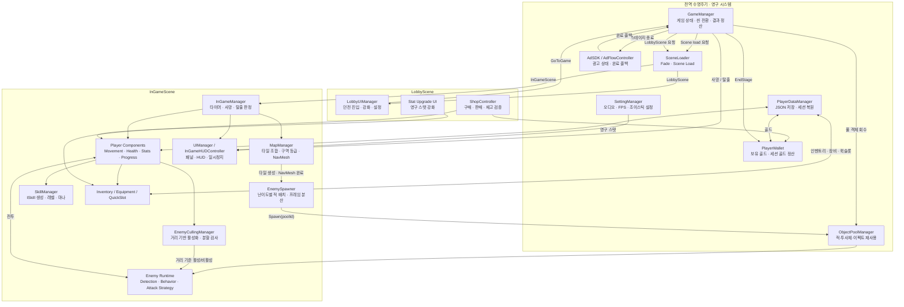
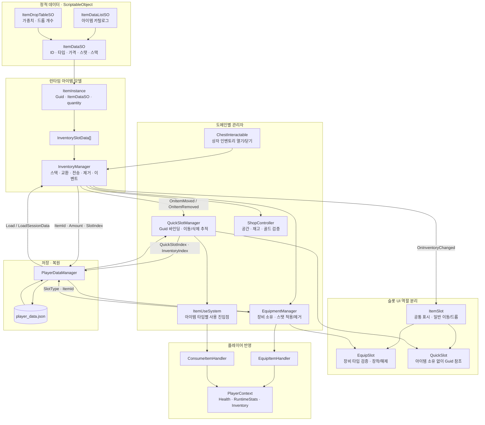
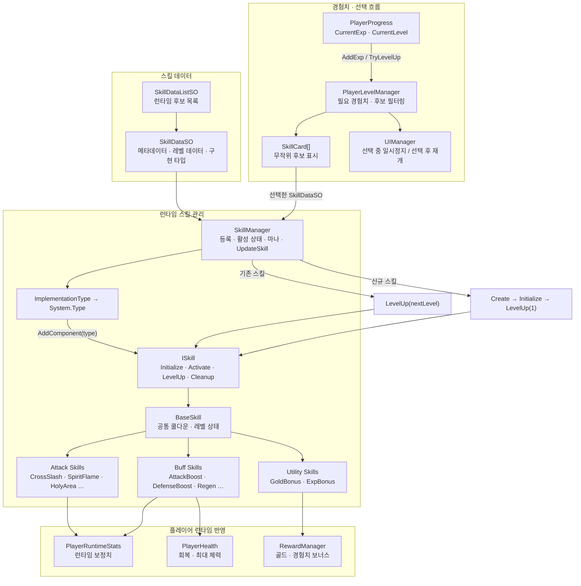
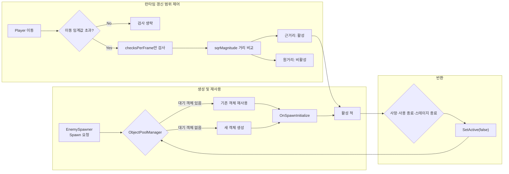
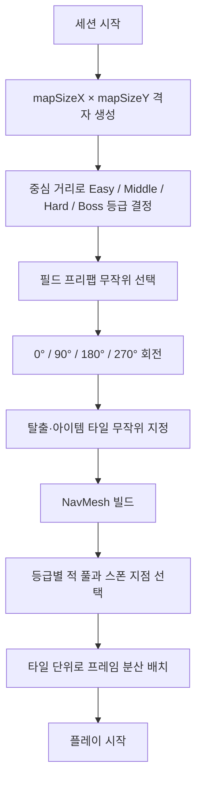

# ASH:BORN 시스템 아키텍처

이 문서는 `Assets/Scripts`의 실제 클래스와 책임을 기준으로 정리한 Mermaid 아키텍처 문서입니다. 저장소의 씬과 상용 리소스는 공개 범위에서 제외되어 있으므로, 코드에서 확인 가능한 런타임 흐름과 책임 경계를 중심으로 설명합니다.

## 1. 전체 클라이언트 흐름

### 책임 경계

| 영역 | 핵심 책임 | 대표 코드 |
|---|---|---|
| 전역 게임 흐름 | 상태 전환, 씬 이동, 게임 종료 정산 | `GameManager`, `SceneLoader` |
| 인게임 세션 | 타이머, 사망, 탈출 성공 여부 | `InGameManager`, `EscapePortal3D` |
| 맵 생성 | 타일 조합, 구역 등급, 이벤트 타일, NavMesh 생성 | `MapManager`, `Tile` |
| 적 생성과 재사용 | 난이도별 적 선택, 풀링 객체 배치, 재사용 초기화 | `EnemySpawner`, `ObjectPoolManager`, `EnemyController` |
| 런타임 부하 제어 | 거리 기반 적 활성화, 분할 검사 | `EnemyCullingManager` |
| 플레이어 런타임 | 이동, 체력, 경험치, 스탯 | `PlayerMovement`, `PlayerHealth`, `PlayerProgress`, `PlayerRuntimeStats` |
| UI | HUD와 패널 표시, 일시정지 | `UIManager`, `InGameHUDController`, `LobbyUIManager` |
| 데이터 지속성 | JSON 저장과 씬 간 세션 복원 | `PlayerDataManager` |

## 2. 인벤토리 · 장비 · 퀵슬롯

### 핵심 설계 포인트

- `ItemDataSO`는 변하지 않는 원형 데이터이고, 실제 획득 아이템은 `ItemInstance`입니다.
- 각 `ItemInstance`는 `Guid`를 가지므로 퀵슬롯은 인벤토리 슬롯 위치가 바뀌어도 같은 아이템을 추적할 수 있습니다.
- `ItemSlot`은 공통 UI와 일반 인벤토리 이동을 담당하고, `EquipSlot`과 `QuickSlot`은 서로 다른 소유권과 드롭 규칙을 확장합니다.
- 장비 슬롯은 아이템을 장비 도메인으로 이동시키고 스탯을 반영하지만, 퀵슬롯은 아이템을 복제하거나 소유하지 않고 GUID만 참조합니다.
- 인벤토리의 이동·삭제 이벤트를 `QuickSlotManager`가 구독하여 참조 무결성을 유지합니다.

## 3. 스킬 · 레벨업 성장

### 핵심 설계 포인트

- `SkillDataSO`는 스킬 메타데이터와 레벨 데이터를 보유하고, 실제 실행은 `ISkill` 구현체가 담당합니다.
- `SkillManager`는 구현 타입을 `System.Type`으로 매핑하고 런타임에 컴포넌트를 생성합니다.
- 이미 보유한 스킬을 다시 선택하면 새 객체를 만들지 않고 기존 인스턴스의 레벨을 올립니다.
- `PlayerLevelManager`는 최대 레벨 스킬을 제외하고 후보를 구성하며, 선택 중에는 `UIManager`가 게임을 일시정지합니다.

## 4. 생성·활성화 최적화 흐름

### 핵심 설계 포인트

- 반복 생성되는 적과 전투 객체는 `ObjectPoolManager`를 통해 재사용합니다.
- 풀에서 꺼낸 적은 `EnemyController.OnSpawnInitialize`를 거쳐 이전 생명주기의 상태를 초기화합니다.
- `EnemyCullingManager`는 플레이어가 일정 거리 이상 움직인 경우에만 검사를 수행합니다.
- 검사 대상도 한 프레임에 전부 처리하지 않고 `checksPerFrame` 단위로 나눕니다.
- 거리 비교에는 `sqrMagnitude`를 사용하여 제곱근 계산을 피합니다.

> 현재 공개 코드에서는 이동 판정과 분할 검사 진행이 결합되어 있어, 첫 chunk 이후 플레이어가 멈추면 남은 대상 검사가 이어지지 않을 수 있습니다. 전체 scan 완료를 보장하는 상태 기반 구현은 아직 반영되지 않았으며, 자세한 진단은 [기술 문서](../technical/README.md#1-enemy-multi-frame-scan-stopping-after-the-first-chunk)에 기록합니다.

## 5. 런타임 맵 조합 흐름

맵은 완전한 절차적 메시 생성 대신, 검증된 타일 프리팹을 선택·회전·배치하는 방식입니다. 1인 개발 일정에서 제작과 검증 범위를 통제하면서 매 세션의 진행 경로와 이벤트 위치가 달라지도록 구성했습니다.

## Mermaid 원본

- [`client-flow.mmd`](client-flow.mmd)
- [`inventory-system.mmd`](inventory-system.mmd)
- [`skill-system.mmd`](skill-system.mmd)
- [`performance-flow.mmd`](performance-flow.mmd)
- [`map-generation-flow.mmd`](map-generation-flow.mmd)

## 관련 문서

- [성능 최적화 및 트러블슈팅](../technical/README.md)
- [프로젝트 루트 README](../../README.md)
