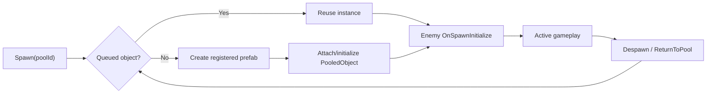
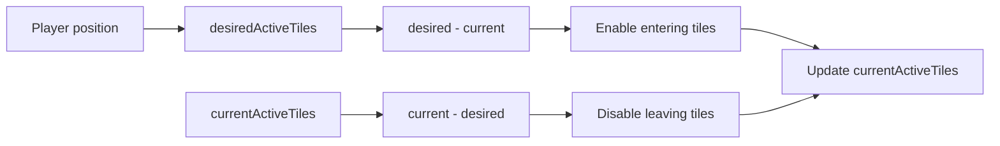

# ASH:BORN 기술 근거 문서

공개 포트폴리오 상태: **Google Play 비공개 테스트 완료 · 프로덕션 출시 심사 진행**

현재 공개 Unity 클라이언트 코드에서 직접 확인할 수 있는 엔지니어링 근거를 정리합니다. 최종 근거는 항상 소스 코드입니다. 아래 설명은 현재 로컬 저장소의 구현만을 대상으로 하며, [렌더링 프로파일링](#rendering-profiling)의 측정값은 공개 저장소 외부 기록임을 별도로 표시합니다.

## 현재 공개 코드 점검

현재 공개 코드에서 두 가지 최신 런타임 수정과 진단 수단을 확인했습니다.

| 영역 | 현재 공개 코드 | 포트폴리오 문서화 기준 |
|---|---|---|
| Enemy Multi-frame Scan | [`EnemyCullingManager`](../../Assets/Scripts/Managers/EnemyCullingManager.cs)는 시작 위치와 대상 수를 캡처하고, `_scanInProgress`와 `_currentIndex`로 전체 대상 처리가 끝날 때까지 scan을 유지합니다. | 전체 scan을 여러 frame에 나누어 완료하는 구현으로 문서화합니다. |
| Grid-based Tile Activation | [`MapManager`](../../Assets/Scripts/Managers/MapManager.cs)는 `_desiredActiveTiles`와 `_activeTiles`를 비교해 반경에서 나간 tile을 끄고 새로 들어온 tile을 켭니다. | Grid Active Set 조정 구현으로 문서화합니다. |

현재 공개 코드에서 확인되는 근거:

- 풀 등록과 재사용: [`ObjectPoolManager`](../../Assets/Scripts/Managers/ObjectPoolManager.cs), [`PooledObject`](../../Assets/Scripts/Object/PooledObject.cs)
- 풀링된 적의 생명주기 초기화: [`EnemyController.OnSpawnInitialize`](../../Assets/Scripts/Enemy/EnemyController.cs), [`EnemySpawner`](../../Assets/Scripts/Enemy/EnemySpawner.cs)
- 코루틴 `yield` 기반 생성 작업 분산: [`EnemySpawner.CoSpawnAllEnemies`](../../Assets/Scripts/Enemy/EnemySpawner.cs)
- 이벤트 기반 UI와 상태 갱신: [`InventoryManager`](../../Assets/Scripts/Managers/InventoryManager.cs), [`QuickSlotManager`](../../Assets/Scripts/Managers/QuickSlotManager.cs), [`SkillManager`](../../Assets/Scripts/Managers/SkillManager.cs), [`InGameHUDController`](../../Assets/Scripts/UI/InGameHUDController.cs), [`PlayerWallet`](../../Assets/Scripts/Player/PlayerWallet.cs)
- Inventory·Equipment·QuickSlot 소유권 분리: [`InventoryManager`](../../Assets/Scripts/Managers/InventoryManager.cs), [`EquipmentManager`](../../Assets/Scripts/Managers/EquipmentManager.cs), [`QuickSlotManager`](../../Assets/Scripts/Managers/QuickSlotManager.cs)

<a id=runtime-performance></a>
## 런타임 성능

### 오브젝트 풀링 (Object Pooling)

#### 문제

전투 중 적, 투사체, VFX 오브젝트가 반복적으로 생성·제거됩니다. 모바일 환경에서 반복적인 `Instantiate`와 `Destroy`는 할당과 생명주기 처리 부담을 전투 중에 집중시킬 수 있습니다.

#### 관찰

공개 코드는 재사용 가능한 오브젝트를 `poolId` 기반 풀로 관리합니다. [`ObjectPoolManager`](../../Assets/Scripts/Managers/ObjectPoolManager.cs)는 풀마다 `Queue<GameObject>`와 prefab 정보를 보관하고, [`PooledObject`](../../Assets/Scripts/Object/PooledObject.cs)는 올바른 풀로 돌아가기 위한 id를 저장합니다.

#### 변경

`ObjectPoolManager.Spawn`은 비활성 인스턴스가 있으면 재사용하고, 없으면 등록된 prefab으로 생성합니다. `Despawn`은 오브젝트를 비활성화한 뒤 큐로 돌려보냅니다. [`EnemySpawner`](../../Assets/Scripts/Enemy/EnemySpawner.cs)는 적 prefab을 직접 생성하지 않고 풀에서 가져옵니다.



#### 검증

풀 등록, 큐 재사용, 풀 소유 정보, 풀 기반 적 생성을 연결된 코드에서 확인했습니다. FPS, CPU ms, GC Alloc, GPU ms, 메모리, frame time 개선을 입증하는 공개 캡처는 없어 수치로 주장하지 않습니다.

### Enemy Multi-frame Scan

#### 문제

등록된 적이 많을 때 전체 거리 검사를 한 프레임에 수행하면 작업이 집중될 수 있습니다. `checksPerFrame`으로 나누더라도 시작한 스캔은 전체 대상 목록을 끝까지 처리해야 합니다.

#### 관찰

[`EnemyCullingManager`](../../Assets/Scripts/Managers/EnemyCullingManager.cs)는 이동량이 `updateThreshold`를 넘으면 `BeginScan`을 호출합니다. 이때 `_scanPlayerPosition`과 `_scanTargetCount`를 캡처하고 `_scanInProgress`를 활성화합니다.

#### 변경

`ProcessScanChunk`는 `_currentIndex`가 `_scanTargetCount`에 도달할 때까지 frame마다 최대 `checksPerFrame`개를 처리합니다. null 항목도 `_currentIndex`와 `processedCount`를 증가시켜 scan slot을 소비합니다. 현재 scan이 끝난 뒤 다음 Update에서 새 이동량을 검사하므로, scan 도중의 이동은 다음 scan에 반영됩니다.

#### 검증

코드에서 scan이 진행 중이면 이동 여부와 관계없이 `ProcessScanChunk`가 계속 호출되는 흐름을 확인했습니다. `EnemyCulling.ScanChunk` ProfilerMarker와 Development Build 진단 값으로 scan index, 진행 여부, 완료 cycle, 활성 Enemy 수를 확인할 수 있습니다.

### Grid-based Tile Activation

#### 문제

거리 기준으로 주변 map tile만 활성화하더라도, 활성 반경을 벗어난 tile을 명시적으로 꺼야 합니다. 새 후보 영역만 검사하면 플레이어 이동 중 이전 tile이 누적될 수 있습니다.

#### 관찰

과거 수정 전 디버깅에서는 다음 활성 tile 수가 관찰되었습니다.

```text
Active Tiles: 4 → 9 → 14 → 15
```

이는 **수정 전 문제 기록**이며 수정 후 측정값이 아닙니다. 현재 [`MapManager`](../../Assets/Scripts/Managers/MapManager.cs)는 플레이어 Grid 좌표와 tile 단위 반경을 계산하고 거리 제곱으로 `_desiredActiveTiles`를 구성합니다.

#### 변경

현재 코드는 `sqrMagnitude`로 후보를 계산하고 다음 Grid Active Set 조정을 수행합니다.



#### 검증

코드에서 `activeRadius * activeRadius`, `sqrMagnitude`, `_desiredActiveTiles`, `_activeTiles`의 차집합 처리와 집합 교체를 확인했습니다. `MapManager.UpdateActiveTiles` ProfilerMarker, Development Build 진단 값, Scene Gizmo로 활성 tile·반경·현재 Grid를 확인할 수 있습니다. 수정 후 정량 tile 수는 기록하지 않습니다.

### 적 생성 작업 분산 (Enemy Spawn Work Distribution)

#### 문제

맵 생성 직후 모든 tile과 spawn point를 한 프레임에 처리하면 dungeon 진입 시점에 작업이 집중될 수 있습니다.

#### 관찰

[`EnemySpawner.CoSpawnAllEnemies`](../../Assets/Scripts/Enemy/EnemySpawner.cs)는 NavMesh 생성 다음 프레임부터 tile과 spawn point를 순회하고 tile마다 `yield`합니다.

#### 변경

각 tile 처리 후 `yield return null`로 작업을 분산합니다. 적은 [`ObjectPoolManager`](../../Assets/Scripts/Managers/ObjectPoolManager.cs)에서 가져온 뒤 NavMesh 배치, `OnSpawnInitialize`, wander data 설정 순서로 초기화됩니다.

#### 검증

코루틴과 tile 단위 `yield return null`을 확인했습니다. timing 측정값은 없어 정량적 로딩 개선이 아니라 작업 분산 구현 근거로 설명합니다.

### 이벤트 기반 UI (Event-driven UI)

#### 문제

UI가 매 프레임 상태를 polling하면 불필요한 갱신과 동기화 복잡도가 생길 수 있습니다.

#### 관찰

공개 코드에서 다음 상태 변경 이벤트를 확인할 수 있습니다.

| 이벤트 | 코드 근거 |
|---|---|
| `OnInventoryChanged` | [`InventoryManager`](../../Assets/Scripts/Managers/InventoryManager.cs) |
| `OnItemMoved` / `OnItemRemoved` | [`InventoryManager`](../../Assets/Scripts/Managers/InventoryManager.cs), [`QuickSlotManager`](../../Assets/Scripts/Managers/QuickSlotManager.cs) |
| `OnManaChanged` | [`SkillManager`](../../Assets/Scripts/Managers/SkillManager.cs), [`PlayerHUDController`](../../Assets/Scripts/UI/PlayerHUDController.cs) |
| `OnSecondElapsed` | [`InGameManager`](../../Assets/Scripts/Managers/InGameManager.cs), [`InGameHUDController`](../../Assets/Scripts/UI/InGameHUDController.cs) |
| `OnGoldChanged` | [`PlayerWallet`](../../Assets/Scripts/Player/PlayerWallet.cs), [`LobbyUIManager`](../../Assets/Scripts/UI/LobbyUIManager.cs) |
| `OnKilled` | [`PlayerHealth`](../../Assets/Scripts/Player/PlayerHealth.cs), [`EnemyHealth`](../../Assets/Scripts/Enemy/EnemyHealth.cs) |

#### 변경

Inventory 변경, item 이동·제거 후 QuickSlot 재연결, Mana 표시, 1초 단위 Timer, Gold UI 갱신은 상태 이벤트를 사용합니다.

#### 검증

연결된 소스에서 이벤트 선언·호출·구독을 확인했습니다. 모든 UI가 이벤트 기반이라고 주장하지 않고 공개 코드에서 확인되는 경로만 설명합니다.

<a id=rendering-profiling></a>
## 렌더링 프로파일링 (Rendering Profiling)

렌더링 검증은 다음 순서로 진행했습니다.

```text
Profiler → Frame Debugger → 통제된 A/B 테스트 → 검증된 대상에만 적용
```

다음 InGame baseline은 **현재 공개 저장소 외부에서 기록된 측정값**입니다. 이를 독립적으로 확인할 원본 캡처는 저장소에 없습니다.

| 지표 | 기록값 |
|---|---:|
| Batches | 63 |
| SetPass | 37 |
| Triangles | 24.1k |
| Vertices | 48.7k |

GPU Instancing 통제 benchmark 조건:

- `MeshRenderer` 64개
- 동일 Mesh / Material
- Windows Editor / DX12

결과:

```text
동일 Mesh/Material 조건의 64 MeshRenderer 테스트 환경에서
GPU Instancing 적용 전후 Batches 67 → 4를 확인했습니다.
```

공개 저장소 외부에서 기록한 통제 benchmark 결과이며, 게임 전체 Batches가 `67 → 4`가 되었다는 뜻이 아닙니다. Profiler baseline, Frame Debugger, Instancing off/on 원본 캡처는 현재 저장소에 없습니다.

<a id=troubleshooting></a>
## 트러블슈팅 (Troubleshooting)

<a id=1-enemy-multi-frame-scan-stopping-after-the-first-chunk></a>
### 1. 첫 chunk 이후 멈추던 Enemy Multi-frame Scan

#### 문제

`checksPerFrame`을 도입한 초기 구현에서는 이동 감지 후 첫 chunk만 처리되는 문제가 있었습니다.

#### 관찰 / 진단

이전 구현은 전체 적을 확인하기 전에 `_lastCheckedPlayerPos`를 갱신했으며, 플레이어가 멈추면 남은 chunk가 실행되지 않았습니다.

#### 근본 원인

이동 감지와 scan 진행 상태가 결합되어 있었습니다.

#### 수정

`BeginScan`에서 기준 위치와 대상 수를 캡처하고, `_scanInProgress`와 `_currentIndex`를 유지해 전체 대상 처리가 끝날 때까지 `ProcessScanChunk`를 계속 실행하도록 분리했습니다.

#### 검증

[`EnemyCullingManager`](../../Assets/Scripts/Managers/EnemyCullingManager.cs)에서 scan 진행 중에는 이동 여부와 관계없이 chunk가 계속 처리되는 흐름을 확인했습니다. ProfilerMarker와 Development Build 진단 값도 포함되어 있습니다.

<a id=2-grid-active-tiles-accumulating-during-movement></a>
### 2. 이동 중 누적되던 Grid Active Tiles

#### 문제

새 후보 영역만 검사하고 원하는 활성 영역을 벗어난 tile을 끄지 않으면 활성 tile이 누적될 수 있었습니다.

#### 관찰 / 진단

수정 전 활성 tile 수가 `4 → 9 → 14 → 15`로 증가하는 현상을 확인했습니다.

#### 근본 원인

이전 구현은 현재 활성 집합을 별도로 보관하지 않아 `current - desired`에 해당하는 비활성화 처리를 할 수 없었습니다.

#### 수정

`_desiredActiveTiles`와 `_activeTiles`를 분리하고 다음처럼 조정합니다.

```text
desiredActiveTiles = 현재 플레이어 주변에서 필요한 tile
activeTiles - desiredActiveTiles => 비활성화
desiredActiveTiles - activeTiles => 활성화
activeTiles = desiredActiveTiles
```

조정 후 두 HashSet을 교체해 다음 갱신에서 재사용합니다.

#### 검증

[`MapManager`](../../Assets/Scripts/Managers/MapManager.cs)에서 차집합 처리, 거리 제곱 비교, `MapManager.UpdateActiveTiles` ProfilerMarker, Development Build 진단 값, Scene Gizmo를 확인했습니다. `4 → 9 → 14 → 15`는 수정 전 기록이며 수정 후 수치로 사용하지 않습니다.

### 3. 이전 생명주기 상태가 남는 풀링 적

#### 문제

Enemy GameObject를 재사용하면 이전 생명주기의 체력, collider, 사망 flag, behavior variable, target, patrol reference가 남을 수 있습니다.

#### 관찰 / 진단

적은 [`EnemySpawner`](../../Assets/Scripts/Enemy/EnemySpawner.cs)를 통해 풀에서 가져오므로 명시적 reset이 없으면 이전 사망 처리와 AI 상태가 다음 사용으로 이어집니다.

#### 근본 원인

풀링은 GameObject를 파괴하지 않아 component field가 자동 초기화되지 않습니다.

#### 수정

[`EnemyController.OnSpawnInitialize`](../../Assets/Scripts/Enemy/EnemyController.cs)는 체력, collider trigger, behavior graph variable, enemy state, target, 감지 reference, patrol/wander data, `_deathProcessed`를 초기화합니다.

#### 검증

[`EnemySpawner.PlaceEnemyOnNavMesh`](../../Assets/Scripts/Enemy/EnemySpawner.cs)의 호출 순서와 [`EnemyController.OnSpawnInitialize`](../../Assets/Scripts/Enemy/EnemyController.cs)의 reset 로직을 확인했습니다.

### 4. Inventory / Equipment / QuickSlot 소유권 문제

#### 문제

각 slot 유형은 소유권 규칙이 달라 하나의 범용 item slot이 Inventory, Equipment, QuickSlot, Shop, Chest 역할을 모두 안전하게 소유하기 어렵습니다.

#### 관찰 / 진단

Inventory는 `ItemInstance`와 stack/transfer 규칙을 소유하고, Equipment는 장착 상태와 stat을 관리하며, QuickSlot은 Inventory의 item instance를 참조해야 합니다.

#### 근본 원인

slot index만 추적하면 item 이동이나 정렬 후 QuickSlot이 다른 item을 가리킬 수 있습니다.

#### 수정

공개 코드는 책임을 다음처럼 분리합니다.

- [`InventoryManager`](../../Assets/Scripts/Managers/InventoryManager.cs): item instance와 Inventory 동작
- [`EquipmentManager`](../../Assets/Scripts/Managers/EquipmentManager.cs): 장비 상태와 stat 적용·해제
- [`QuickSlot`](../../Assets/Scripts/UI/QuickSlot.cs): 참조 대상 `Guid`
- [`QuickSlotManager`](../../Assets/Scripts/Managers/QuickSlotManager.cs): 이동·제거 이벤트에 따른 연결 갱신

#### 검증

`ItemInstance.instanceId`, `OnItemMoved`, `OnItemRemoved`, `QuickSlot.referencedInstanceId`와 관련 handler를 확인했습니다.

### 5. 제한된 Tile Asset과 반복 가능한 Dungeon 배치

#### 문제

완전 절차 생성은 연결성, collision, NavMesh, 배치, playability 검증 비용이 크고, 하나의 고정 map은 반복 변화를 줄입니다.

#### 관찰 / 진단

[`MapManager`](../../Assets/Scripts/Managers/MapManager.cs)는 검증된 prefab으로 grid를 만들고 거리 기반 tier, prefab 선택, 90도 단위 회전, escape/item tile 배정 후 NavMesh와 적 생성을 진행합니다.

#### 근본 원인

솔로 개발 일정 안에서 구현·검증 비용을 통제하면서 반복 플레이 변화를 확보해야 했습니다.

#### 수정

검증된 tile prefab과 제한된 무작위성, 거리 기반 tier, 후보 기반 특수 tile 배정, NavMesh 생성 후 적 배치 순서를 사용했습니다.

#### 검증

[`MapManager.CreateTiles`](../../Assets/Scripts/Managers/MapManager.cs)의 tile 생성·tier 초기화·NavMesh build와 [`EnemySpawner.CoSpawnAllEnemies`](../../Assets/Scripts/Enemy/EnemySpawner.cs)의 실행 순서를 확인했습니다.

## 의도적으로 포함하지 않은 주장

- Google Play 프로덕션 출시 완료 또는 현재 스토어 서비스 중
- 수정 후 활성 tile 수
- FPS, GC Alloc, CPU ms, GPU ms, 메모리, frame time 개선 수치
- 게임 전체가 `67 → 4` Batches를 달성했다는 주장
- 렌더링 Profiler 캡처가 현재 저장소에 존재한다는 주장

## 추가로 필요한 스크린샷

실제 공개 가능한 성능 캡처가 있다면 다음 경로에 추가할 수 있습니다.

- `Docs/screenshots/performance/runtime-grid-activation.png`
- `Docs/screenshots/performance/profiler-baseline.png`
- `Docs/screenshots/performance/frame-debugger.png`
- `Docs/screenshots/performance/instancing-off.png`
- `Docs/screenshots/performance/instancing-on.png`
