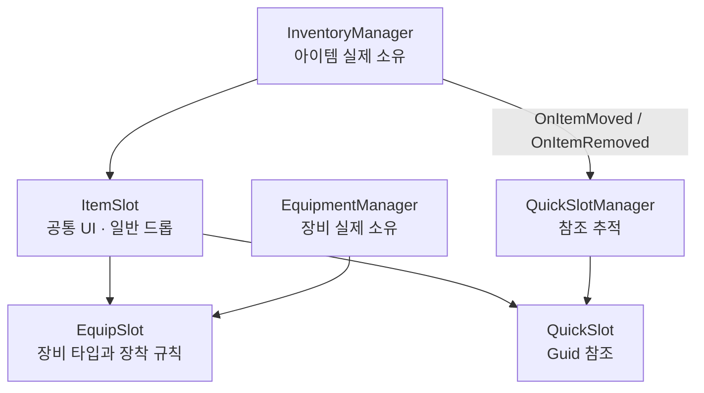
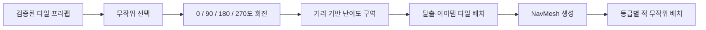

# ASH:BORN 성능 최적화 및 트러블슈팅

이 문서는 공개된 Unity C# 코드와 실제 게임 화면을 기준으로, 구현 과정에서 발생한 문제와 해결 방법을 정리한 기술 문서입니다.

정량적인 FPS·GC 수치는 Unity Profiler 캡처가 저장소에 포함된 이후 별도로 추가할 예정이며, 현재 문서에는 코드에서 직접 확인 가능한 구조와 판단만 기록합니다.

---

## 1. 성능 최적화

### 1.1 반복 생성 객체의 오브젝트 풀링

#### 배경

전투 중 적, 투사체와 스킬 이펙트를 계속 생성하고 파괴하면 `Instantiate`·`Destroy` 비용과 관리 객체 증가가 모바일 환경에서 부담이 될 수 있습니다.

#### 적용

`ObjectPoolManager`가 문자열 `poolId`별 `Queue<GameObject>`를 관리합니다.

```text
EnemySpawner / Skill
        │ Spawn(poolId)
        ▼
ObjectPoolManager
        ├─ 대기 객체가 있으면 재사용
        └─ 없으면 새 인스턴스 생성
                │
                ▼
       PooledObject에 PoolId 저장
                │
                ▼
       사용 종료 후 원래 풀로 반환
```

주요 구현:

- 초기 풀 설정에 따라 객체를 미리 생성
- 반환 시 `SetActive(false)` 처리 후 큐에 저장
- 풀 정보가 없는 객체만 예외적으로 `Destroy`
- 스테이지 종료 시 활성화된 풀 객체 일괄 회수
- 적 생성도 `Instantiate` 대신 `ObjectPoolManager.Spawn` 사용

관련 코드:

- [`ObjectPoolManager`](../../Assets/Scripts/Managers/ObjectPoolManager.cs)
- [`PooledObject`](../../Assets/Scripts/Object/PooledObject.cs)
- [`EnemySpawner`](../../Assets/Scripts/Enemy/EnemySpawner.cs)

### 1.2 풀링된 적의 상태 초기화

풀링은 객체를 재사용하므로 생성 비용은 줄지만, 이전 생명주기의 상태가 남는 문제가 발생할 수 있습니다.

남을 수 있는 상태:

- 사망 전 체력
- Collider의 Trigger 상태
- Behavior Graph의 `IsDead`, `IsSuspicious`, `IsTargetDetected`
- 이전 플레이어 Target
- 배회 위치와 탐지 참조
- 사망 보상 중복 지급 여부

`EnemyController.OnSpawnInitialize`를 재사용 진입점으로 두고 다음 상태를 복원했습니다.

```text
체력 초기화
→ Collider 복구
→ AI Blackboard 변수 초기화
→ 플레이어 Target 재설정
→ 탐지 참조 갱신
→ 사망 처리 플래그 초기화
```

이 초기화 덕분에 풀에서 꺼낸 적을 새로 생성된 적과 같은 상태로 사용할 수 있습니다.

관련 코드:

- [`EnemyController`](../../Assets/Scripts/Enemy/EnemyController.cs)
- [`EnemySpawner`](../../Assets/Scripts/Enemy/EnemySpawner.cs)

### 1.3 플레이어 거리 기반 적 활성화


`EnemyCullingManager`는 카메라 프러스텀 컬링이 아니라 플레이어와 적 사이의 거리를 기준으로 GameObject를 활성화하거나 비활성화합니다.

적용한 비용 절감 방식:

| 항목 | 적용 방식 |
|---|---|
| 거리 계산 | `Vector3.Distance` 대신 `sqrMagnitude` 비교 |
| 검사 시점 | 플레이어가 `updateThreshold` 이상 이동한 경우만 실행 |
| 검사 분산 | 프레임당 `checksPerFrame`개만 순차 검사 |
| 예외 처리 | 사망한 적은 활성화 검사에서 제외 |
| 원거리 처리 | 기준 거리 밖의 적 GameObject 비활성화 |

따라서 플레이어가 멈춰 있는 동안 같은 거리 계산을 반복하지 않고, 적이 많아져도 모든 적의 상태 검사가 한 프레임에 집중되지 않습니다.

관련 코드:

- [`EnemyCullingManager`](../../Assets/Scripts/Managers/EnemyCullingManager.cs)

### 1.4 맵을 타일 단위로 분리

맵을 하나의 대형 오브젝트로 구성하지 않고 `Tile[,]` 격자로 관리합니다.

`MapManager`는 다음 방식으로 갱신 후보를 제한합니다.

- 플레이어가 `updateThreshold` 이상 이동한 경우만 주변 타일 계산
- 플레이어의 현재 격자 좌표 계산
- `activeRadius / tileSize`로 검사할 타일 반경 계산
- 후보 타일에 대해서만 거리 제곱값 비교

이 구조는 맵 전체를 매 프레임 순회하는 대신, 플레이어 주변의 타일을 활성화 판단 단위로 사용할 수 있게 합니다.

> 현재 구현은 주변 후보 범위를 중심으로 활성화 여부를 갱신합니다. 맵 크기가 커질 경우에는 이전 활성 타일 집합을 별도로 보관하여 범위 밖 타일을 명시적으로 비활성화하는 방식으로 확장할 수 있습니다.

관련 코드:

- [`MapManager`](../../Assets/Scripts/Managers/MapManager.cs)
- [`Tile`](../../Assets/Scripts/Map/Tile.cs)

### 1.5 적 배치 작업의 프레임 분산

맵 생성 직후 모든 타일의 적을 한 프레임에 배치하지 않습니다.

`EnemySpawner.CoSpawnAllEnemies`는:

1. NavMesh 생성 완료를 기다립니다.
2. 타일별 스폰 지점을 순회합니다.
3. 적을 풀에서 가져와 초기화합니다.
4. 타일 하나의 처리가 끝날 때마다 `yield return null`로 다음 프레임에 이어서 작업합니다.

초기 진입 순간에 적 생성과 NavMesh 배치가 한 프레임에 집중되는 것을 줄이기 위한 구조입니다.

### 1.6 이벤트 기반 UI 갱신

게임 화면과 인벤토리 UI는 매 프레임 데이터를 조회하지 않고 변경 이벤트에 반응합니다.

| 이벤트 | 소비자 |
|---|---|
| `OnInventoryChanged` | 일반 인벤토리 슬롯 |
| `OnItemMoved` | 퀵슬롯 참조 재확인 |
| `OnItemRemoved` | 삭제된 퀵슬롯 바인딩 해제 |
| `OnManaChanged` | 마나 HUD |
| `OnSecondElapsed` | 타이머 HUD |
| `OnGoldChanged` | 골드 UI |
| `OnKilled` | 게임 종료 흐름 |

마나는 내부적으로 실수 단위로 변하더라도 화면에 표시되는 정수 값이 달라진 경우에만 이벤트를 발생시키고, 타이머는 1초 단위로 UI에 전달합니다.

---

## 2. 트러블슈팅

### 2.1 하나의 아이템 슬롯으로 모든 슬롯을 처리하려 했던 문제


#### 문제

초기에는 일반 아이템 슬롯 하나를 재사용하여 다음 기능을 모두 처리하려 했습니다.

- 일반 인벤토리
- 장착 장비
- 퀵슬롯
- 상자 인벤토리
- 상점 드래그 앤 드롭

그러나 각 슬롯이 같은 모양을 사용하더라도 실제 성질은 달랐습니다.

| 슬롯 | 데이터를 소유하는가 | 주요 규칙 |
|---|---:|---|
| 일반 슬롯 | 예 | 스택, 교환, 다른 인벤토리로 전송 |
| 장비 슬롯 | 장비 도메인이 소유 | 타입 검증, 스탯 적용·제거, 장착 교환 |
| 퀵슬롯 | 아니요 | 소비 아이템의 GUID만 참조 |
| 상자 슬롯 | 예 | 플레이어 인벤토리와 양방향 전송 |

#### 원인

하나의 클래스에서 모든 규칙을 처리하면 `sourceSlot`과 `targetSlot` 조합에 따른 조건 분기가 계속 증가했습니다.

특히 퀵슬롯은 실제 아이템을 복제해서 넣는 슬롯이 아니었습니다. 인벤토리 슬롯 인덱스만 기억할 경우 아이템을 이동하거나 정렬한 뒤 다른 아이템을 가리키는 문제가 생길 수 있었습니다.

#### 해결



- 공통 표시와 드래그 진입점은 `ItemSlot`에 유지
- 장착 검증과 스탯 반영은 `EquipSlot`·`EquipmentManager`로 분리
- 퀵슬롯은 `ItemInstance.Guid`만 저장
- 아이템 이동·삭제 이벤트가 발생하면 `QuickSlotManager`가 참조 갱신
- 상자와 플레이어 인벤토리 사이의 스택·교환·전송은 `InventoryManager`에서 처리

#### 결과

UI 표현은 재사용하면서도 데이터 소유권과 도메인 규칙을 분리했습니다.

- 아이템 이동 후에도 퀵슬롯이 같은 인스턴스를 추적
- 아이템 소모·판매·삭제 시 퀵슬롯 자동 해제
- 장착 아이템과 일반 아이템의 소유권 충돌 방지
- 장비 타입에 맞지 않는 슬롯으로의 드롭 차단

관련 코드:

- [`ItemSlot`](../../Assets/Scripts/UI/ItemSlot.cs)
- [`EquipSlot`](../../Assets/Scripts/UI/EquipSlot.cs)
- [`QuickSlot`](../../Assets/Scripts/UI/QuickSlot.cs)
- [`InventoryManager`](../../Assets/Scripts/Managers/InventoryManager.cs)
- [`EquipmentManager`](../../Assets/Scripts/Managers/EquipmentManager.cs)
- [`QuickSlotManager`](../../Assets/Scripts/Managers/QuickSlotManager.cs)

### 2.2 상자와 플레이어 인벤토리 간 아이템 전송


#### 문제

상자 UI는 일반 인벤토리와 같은 슬롯을 사용하지만 서로 다른 `InventoryManager`가 데이터를 소유합니다. 같은 인벤토리 내부 교환 규칙만으로는 다음 상황을 처리할 수 없었습니다.

- 빈 슬롯으로 이동
- 동일 아이템 스택 병합
- 서로 다른 아이템 교환
- 플레이어 인벤토리가 가득 찬 경우
- 상자 전체 획득

#### 해결

드롭 대상을 기준으로 같은 인벤토리인지 다른 인벤토리인지 먼저 구분했습니다.

```text
같은 InventoryManager
    ├─ 같은 아이템이면 스택 병합
    └─ 그 외에는 슬롯 교환

다른 InventoryManager
    ├─ TransferItemTo 시도
    ├─ 스택 가능하면 수량 일부 또는 전체 이동
    └─ 전송 불가 시 SwapBetweenInventories 검토
```

`TransferAllItemsTo`는 대상 인벤토리에 공간이 없으면 전송을 중단하여 원본 데이터가 사라지지 않도록 했습니다.

### 2.3 제한된 에셋으로 매 세션 다른 맵 만들기

#### 문제

완전한 절차적 맵 생성은 지형 연결, NavMesh, 충돌, 오브젝트 배치와 플레이 가능성 검증까지 필요했습니다. 1인 개발 일정에서는 구현 범위가 지나치게 커질 수 있었습니다.

반대로 완성된 고정 맵 하나만 사용하면 반복 플레이의 변화가 부족했습니다.

#### 해결

검증된 타일 프리팹을 런타임에 선택하고 회전하는 절충안을 선택했습니다.



적용 요소:

- 필드 타일 프리팹 무작위 선택
- 90도 단위 회전으로 길과 오브젝트 배치 변화
- 중심과의 맨해튼 거리에 따른 구역 등급
- 각 구역의 탈출 타일 무작위 지정
- 아이템 타일 무작위 지정
- 난이도별 적 풀과 스폰 위치 무작위 선택
- 맵 조합 후 NavMesh 생성, 이후 적 배치

#### 결과

완전한 절차적 생성보다 제작·검증 비용을 제한하면서, 매 세션의 진행 경로와 이벤트·적 구성을 변경할 수 있었습니다.

관련 코드:

- [`MapManager`](../../Assets/Scripts/Managers/MapManager.cs)
- [`Tile`](../../Assets/Scripts/Map/Tile.cs)
- [`EnemySpawner`](../../Assets/Scripts/Enemy/EnemySpawner.cs)

### 2.4 게임 종료 결과와 세션 정산 책임 분리


#### 문제

사망, 광고 부활, 탈출 성공과 로비 복귀가 모두 UI 버튼에서 직접 처리되면 씬 이동과 데이터 정산 규칙이 UI 코드에 섞일 수 있었습니다.

#### 해결

- `InGameManager`: 사망과 탈출 성공 여부 판정
- `GameManager`: 상태 변경, 실패 데이터 초기화, 스테이지 정산과 씬 이동
- `PlayerWallet`: 성공 여부와 광고 시청 여부에 따른 골드 정산
- `UIManager`: 결과 패널 표시와 일시정지
- `AdFlowController`: 광고 완료 콜백 전달

UI에서 직접 세션 데이터를 변경하지 않고 게임 흐름 관리자에 요청하도록 역할을 나눴습니다.

---

## 3. 추가 개선 항목

현재 공개 코드 기준으로 다음 항목은 추가 개선 가치가 있습니다.

### 맵 활성 타일 집합 관리

현재 `MapManager`는 플레이어 주변 후보 타일을 중심으로 검사합니다. 맵 크기를 확장할 경우에는 이전 프레임의 활성 타일 집합을 별도로 관리하고, 새 범위에서 제외된 타일을 명시적으로 비활성화하는 방식이 더 안전합니다.

### 풀 확장 정책 명시

`PoolConfig`에는 `expandable` 설정이 있지만 현재 스폰 로직은 큐가 비면 새 객체를 생성합니다. 고정 크기 풀과 자동 확장 풀을 실제로 구분하려면 풀별 정책을 별도 딕셔너리로 저장하고 스폰 시 검사해야 합니다.

### 인벤토리 도메인과 UI 분리

현재 `InventoryManager`가 런타임 데이터 규칙과 일부 UI 바인딩을 함께 담당합니다. 규모가 커질 경우 다음과 같이 분리할 수 있습니다.

```text
InventoryModel
├─ 아이템 추가·삭제·스택·이동
└─ 변경 이벤트

InventoryView
└─ 슬롯 생성과 화면 갱신

InventoryPresenter
└─ Model 이벤트를 View에 전달
```

이 항목들은 현재 기능이 동작하지 않는다는 의미가 아니라, 프로젝트 규모 확장 시 책임 경계를 더 명확하게 만들기 위한 후속 개선 방향입니다.
