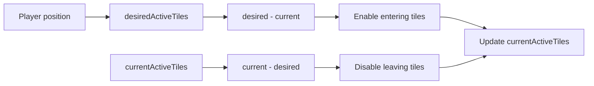

# ASH:BORN 기술 노트

ASH:BORN을 개발하면서 적용한 런타임 최적화와 실제 문제 해결 과정을 정리했습니다.  
각 항목은 공개된 Unity C# 코드와 연결해 구현을 함께 확인할 수 있도록 구성했습니다.

---

## 런타임 최적화

### 오브젝트 풀링

전투 중에는 적, 투사체, VFX처럼 짧은 주기로 반복해서 사용하는 오브젝트가 많습니다.  
이 객체들을 매번 `Instantiate` / `Destroy`하지 않도록 `ObjectPoolManager`에서 `poolId`별로 관리하고, 필요할 때 꺼내 쓰고 다시 반환하도록 구성했습니다.


적은 단순히 다시 활성화하는 것만으로는 충분하지 않았습니다. 풀에서 꺼낸 객체는 새 인스턴스가 아니기 때문에 이전 전투의 체력, Collider 상태, AI 변수, Target, 사망 처리 상태가 남을 수 있습니다.

그래서 `EnemyController.OnSpawnInitialize`를 재사용 진입점으로 두고 전투에 필요한 상태를 다시 초기화하도록 했습니다.

관련 코드:

- [`ObjectPoolManager`](../../Assets/Scripts/Managers/ObjectPoolManager.cs)
- [`PooledObject`](../../Assets/Scripts/Object/PooledObject.cs)
- [`EnemySpawner`](../../Assets/Scripts/Enemy/EnemySpawner.cs)
- [`EnemyController`](../../Assets/Scripts/Enemy/EnemyController.cs)

---

### Enemy Multi-frame Scan

적이 많아질수록 모든 적의 거리를 한 프레임에 검사하는 방식은 순간적인 작업량이 커질 수 있습니다.  
그래서 플레이어가 일정 거리 이상 이동했을 때 scan을 시작하고, `checksPerFrame`만큼 나누어 여러 프레임에 걸쳐 처리하도록 만들었습니다.

현재 구현에서는 scan을 시작할 때 다음 상태를 저장합니다.

- 기준 플레이어 위치 `_scanPlayerPosition`
- scan 시작 시점의 대상 수 `_scanTargetCount`
- 진행 여부 `_scanInProgress`
- 현재 처리 위치 `_currentIndex`

시작된 scan은 플레이어가 멈추더라도 전체 대상 처리가 끝날 때까지 계속 진행합니다.  
null 항목도 scan slot을 소비하도록 해 cursor가 대상 수와 일관되게 전진하도록 했습니다.

`EnemyCulling.ScanChunk` ProfilerMarker와 Development Build 진단 값으로 현재 index, 진행 여부, 완료 cycle, 활성 Enemy 수를 확인할 수 있습니다.

관련 코드:

- [`EnemyCullingManager`](../../Assets/Scripts/Managers/EnemyCullingManager.cs)

---

### Grid-based Tile Activation

맵 전체를 항상 활성 상태로 두기보다 플레이어 주변 Tile만 유지하도록 구성했습니다.

`MapManager`는 플레이어 위치를 Grid 좌표로 바꾸고 `activeRadius / tileSize`를 기준으로 후보를 좁힌 뒤, 거리 제곱값으로 실제 활성 대상 Tile을 결정합니다.

현재 필요한 Tile과 이미 활성화된 Tile을 각각 집합으로 관리합니다.



- `current - desired` → 반경에서 벗어난 Tile 비활성화
- `desired - current` → 새로 들어온 Tile 활성화

`MapManager.UpdateActiveTiles` ProfilerMarker와 Development Build 진단 값, Scene Gizmo를 통해 Active Radius, Current Grid, 활성 Tile 상태를 확인할 수 있습니다.

관련 코드:

- [`MapManager`](../../Assets/Scripts/Managers/MapManager.cs)
- [`Tile`](../../Assets/Scripts/Map/Tile.cs)

---

### 적 생성 작업 분산

맵 생성 직후 모든 Tile과 spawn point를 한 프레임에 처리하지 않도록 적 배치도 나누었습니다.

`EnemySpawner.CoSpawnAllEnemies`는 NavMesh가 준비된 뒤 Tile과 spawn point를 순회하고, Tile 하나의 처리가 끝날 때마다 `yield return null`로 다음 프레임에 작업을 이어갑니다.

적은 풀에서 가져온 뒤 NavMesh 배치, `OnSpawnInitialize`, wander data 설정 순서로 초기화됩니다.

관련 코드:

- [`EnemySpawner`](../../Assets/Scripts/Enemy/EnemySpawner.cs)
- [`ObjectPoolManager`](../../Assets/Scripts/Managers/ObjectPoolManager.cs)

---

### 이벤트 기반 UI 갱신

주요 HUD와 Inventory / QuickSlot은 매 프레임 상태를 확인하는 대신 값이 바뀌는 시점에 이벤트를 전달하도록 구성했습니다.

| 이벤트 | 사용 위치 |
|---|---|
| `OnInventoryChanged` | Inventory UI 갱신 |
| `OnItemMoved` / `OnItemRemoved` | QuickSlot 참조 갱신 |
| `OnManaChanged` | Mana HUD |
| `OnSecondElapsed` | Timer HUD |
| `OnGoldChanged` | Gold UI |
| `OnKilled` | 사망·게임 종료 흐름 |

Inventory 변경, Item 이동·제거, Mana, Timer, Gold처럼 상태 변경 시점이 명확한 값은 이벤트로 연결했습니다.

관련 코드:

- [`InventoryManager`](../../Assets/Scripts/Managers/InventoryManager.cs)
- [`QuickSlotManager`](../../Assets/Scripts/Managers/QuickSlotManager.cs)
- [`SkillManager`](../../Assets/Scripts/Managers/SkillManager.cs)
- [`PlayerHUDController`](../../Assets/Scripts/UI/PlayerHUDController.cs)
- [`InGameHUDController`](../../Assets/Scripts/UI/InGameHUDController.cs)
- [`PlayerWallet`](../../Assets/Scripts/Player/PlayerWallet.cs)

---

## 렌더링 프로파일링

렌더링 문제는 바로 설정을 바꾸기보다 다음 순서로 확인했습니다.

```text
Profiler
→ Frame Debugger
→ 통제된 A/B 테스트
→ 실제 프로젝트에 적용할 조건 결정
```

### InGame Baseline

실제 InGame 화면에서 기록한 기준값입니다.

| 지표 | 기록값 |
|---|---:|
| Batches | 63 |
| SetPass | 37 |
| Triangles | 24.1k |
| Vertices | 48.7k |

### GPU Instancing A/B Test

GPU Instancing 자체의 batching 효과를 분리해서 보기 위해 별도 조건에서 테스트했습니다.

테스트 조건:

- `MeshRenderer` 64개
- 동일 Mesh / Material
- Windows Editor / DX12

결과:

```text
GPU Instancing OFF : 67 Batches
GPU Instancing ON  :  4 Batches
```

이 값은 동일 Mesh / Material 조건에서 batching이 실제로 형성되는지 확인하기 위한 통제 실험 결과입니다.  
게임 전체의 Batches가 `67 → 4`로 변경되었다는 의미는 아닙니다.

---

## 트러블슈팅

### 1. Enemy 거리 검사를 나눴더니 첫 chunk 이후 처리가 멈췄다

적 전체를 한 프레임에 검사하지 않도록 `checksPerFrame` 단위로 나눠 처리하는 기능을 처음 추가했을 때 문제가 생겼습니다.

초기 구현에서는 첫 chunk를 처리한 직후 `_lastCheckedPlayerPos`도 함께 갱신했습니다.  
그 상태에서 플레이어가 멈추면 다음 프레임부터 이동 조건을 만족하지 않아 남은 Enemy가 더 이상 검사되지 않았습니다.

```text
플레이어 이동
→ 첫 chunk 처리
→ 마지막 위치 갱신
→ 플레이어 정지
→ 남은 Enemy scan 중단
```

문제는 **플레이어 이동 감지와 이미 시작된 scan의 진행 여부를 같은 조건으로 묶어둔 것**이었습니다.

그래서 두 상태를 분리했습니다.

- 이동량이 임계값을 넘으면 `BeginScan`
- scan 시작 시 플레이어 위치와 대상 수 캡처
- `_scanInProgress`가 true인 동안 이동 여부와 관계없이 `ProcessScanChunk`
- `_currentIndex`가 대상 수에 도달하면 scan 종료
- 이후 새로운 이동이 발생하면 다음 scan 시작

```text
Begin Scan
→ chunk
→ chunk
→ chunk
→ 전체 대상 완료
→ 다음 이동 시 새 Scan
```

관련 코드:

- [`EnemyCullingManager`](../../Assets/Scripts/Managers/EnemyCullingManager.cs)

---

### 2. 플레이어가 이동할수록 Active Tile이 계속 늘어났다

플레이어 이동 테스트 중 Active Tile 수가 다음처럼 증가하는 것을 확인했습니다.

```text
4 → 9 → 14 → 15
```

원래 의도는 플레이어 주변의 필요한 Tile만 유지하는 것이었기 때문에, 이동할수록 활성 Tile이 누적되는 것은 정상 동작이 아니었습니다.

코드를 확인해보니 새 위치 주변 Tile의 활성 여부는 계산하고 있었지만, **이전 위치에서 켜진 Tile이 새 반경 밖으로 나갔을 때 끄는 과정이 없었습니다.**

그래서 현재 필요한 Tile과 이미 활성화된 Tile을 각각 `HashSet`으로 관리하도록 변경했습니다.

```text
현재 활성 - 현재 필요 → Disable
현재 필요 - 현재 활성 → Enable
```

이후 두 집합을 교체해 다음 갱신에서도 같은 방식으로 비교합니다.

Scene Gizmo에는 Current Grid, Active Radius, Active Tile을 표시해 이동하면서 상태를 확인할 수 있도록 했습니다.

> `4 → 9 → 14 → 15`는 수정 전 문제를 확인할 때 기록한 값입니다.

관련 코드:

- [`MapManager`](../../Assets/Scripts/Managers/MapManager.cs)
- [`Tile`](../../Assets/Scripts/Map/Tile.cs)

---

### 3. Pool에서 다시 꺼낸 Enemy에 이전 상태가 남았다

Pooling을 적용하면서 Enemy를 `Destroy`하지 않고 재사용하게 되었습니다.  
이때 체력만 복구하면 될 것으로 생각하기 쉽지만, 실제로는 이전 생명주기의 여러 상태가 그대로 남을 수 있었습니다.

예를 들어 다음 값들이 재사용 시 문제가 될 수 있습니다.

- 체력
- Collider 상태
- 사망 처리 여부
- Behavior Graph 변수
- Target
- 감지 reference
- patrol / wander data

Pooling된 GameObject는 새 인스턴스가 아니기 때문에 이 값들이 자동으로 초기화되지 않습니다.

그래서 `EnemyController.OnSpawnInitialize`를 재사용 진입점으로 두고, 풀에서 꺼낼 때 필요한 런타임 상태를 한곳에서 다시 설정하도록 정리했습니다.

관련 코드:

- [`EnemyController`](../../Assets/Scripts/Enemy/EnemyController.cs)
- [`EnemySpawner`](../../Assets/Scripts/Enemy/EnemySpawner.cs)

---

### 4. Inventory / Equipment / QuickSlot의 소유권이 섞였다

초기에는 같은 슬롯 UI를 최대한 재사용하려고 했지만, Inventory / Equipment / QuickSlot은 화면 모양만 비슷할 뿐 데이터에 대한 책임은 서로 달랐습니다.

- Inventory는 `ItemInstance`와 stack / transfer 규칙을 소유
- Equipment는 장착 상태와 stat 적용·해제를 관리
- QuickSlot은 Inventory에 존재하는 Item을 참조

특히 QuickSlot이 슬롯 index만 기억하면 Inventory에서 Item을 이동하거나 정렬한 뒤 다른 Item을 가리킬 수 있었습니다.

그래서 Item의 실제 소유권과 UI 참조를 분리했습니다.

- [`InventoryManager`](../../Assets/Scripts/Managers/InventoryManager.cs): ItemInstance와 Inventory 동작
- [`EquipmentManager`](../../Assets/Scripts/Managers/EquipmentManager.cs): 장비 상태와 stat 적용
- [`QuickSlot`](../../Assets/Scripts/UI/QuickSlot.cs): 대상 Item의 GUID 참조
- [`QuickSlotManager`](../../Assets/Scripts/Managers/QuickSlotManager.cs): 이동·삭제 이벤트에 따른 참조 갱신

이 구조로 Inventory에서 Item 위치가 바뀌어도 QuickSlot이 같은 인스턴스를 추적할 수 있게 했습니다.

---

### 5. 완전 절차 생성 대신 검증된 Tile 조합을 선택했다

매 세션 다른 던전을 만들고 싶었지만, 완전한 절차 생성은 지형 연결성, Collision, NavMesh, 오브젝트 배치, 플레이 가능성까지 함께 검증해야 했습니다.

1인 개발 일정에서는 이 범위를 모두 안정적으로 구현하는 것보다, 검증된 Tile prefab을 재조합하는 방식이 적절하다고 판단했습니다.

`MapManager`에서는 다음 요소를 조합합니다.

- Grid 기반 Tile 배치
- 중심에서의 거리에 따른 Area Tier
- Tile prefab 무작위 선택
- 90도 단위 회전
- Escape / Item Tile 후보 배정
- NavMesh 생성 후 Enemy 배치

이 방식으로 구현·검증 범위를 제한하면서도 세션마다 Tile 배치와 진행 경로에 변화를 줄 수 있도록 했습니다.

관련 코드:

- [`MapManager`](../../Assets/Scripts/Managers/MapManager.cs)
- [`EnemySpawner`](../../Assets/Scripts/Enemy/EnemySpawner.cs)

---

## 관련 문서

- [루트 README](../../README.md) — 프로젝트 개요와 주요 코드 진입점
- [클라이언트 구조](../architecture/README.md) — Client / Inventory / Skill / Map 구조
- [스크린샷](../screenshots/portfolio/README.md) — 포트폴리오에 사용한 공개 이미지
