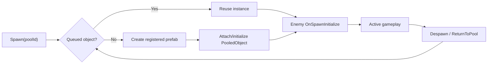
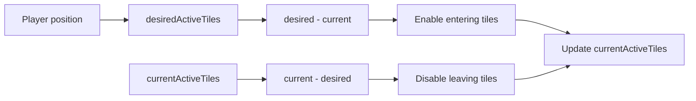

# ASH:BORN Technical Evidence

Public portfolio status: **Google Play 비공개 테스트 완료 · 프로덕션 출시 심사 진행**

This document records engineering evidence visible in the public Unity client subset. Source code remains the final evidence. Claims below are limited to the current local repository, except for the explicitly scoped rendering measurements in [Rendering Profiling](#rendering-profiling).

## Current Public Code Audit

The current public code does **not** contain two newer runtime fixes. They are documented here as mismatches, not completed public-code claims.

| Area | Current public code | Portfolio implication |
|---|---|---|
| Enemy Multi-frame Scan | [`EnemyCullingManager`](../../Assets/Scripts/Managers/EnemyCullingManager.cs) updates `_lastCheckedPlayerPos` before processing only `checksPerFrame` enemies. There is no persistent full-scan state or captured scan target. | The full-scan cursor fix must not be claimed as shipped in this public subset. |
| Grid-based Tile Activation | [`MapManager`](../../Assets/Scripts/Managers/MapManager.cs) checks only the current candidate region around the player. It does not track separate `desiredActiveTiles` and `currentActiveTiles` sets. | Desired/current reconciliation must not be claimed as present in this public subset. |

Confirmed public-code evidence:

- Object pooling and pool registration: [`ObjectPoolManager`](../../Assets/Scripts/Managers/ObjectPoolManager.cs), [`PooledObject`](../../Assets/Scripts/Object/PooledObject.cs)
- Enemy pooled lifecycle reset: [`EnemyController.OnSpawnInitialize`](../../Assets/Scripts/Enemy/EnemyController.cs), [`EnemySpawner`](../../Assets/Scripts/Enemy/EnemySpawner.cs)
- Spawn work distribution with coroutine yielding: [`EnemySpawner.CoSpawnAllEnemies`](../../Assets/Scripts/Enemy/EnemySpawner.cs)
- Event-driven UI/state updates: [`InventoryManager`](../../Assets/Scripts/Managers/InventoryManager.cs), [`QuickSlotManager`](../../Assets/Scripts/Managers/QuickSlotManager.cs), [`SkillManager`](../../Assets/Scripts/Managers/SkillManager.cs), [`InGameHUDController`](../../Assets/Scripts/UI/InGameHUDController.cs), [`PlayerWallet`](../../Assets/Scripts/Player/PlayerWallet.cs)
- Inventory, equipment, and quick slot ownership split: [`InventoryManager`](../../Assets/Scripts/Managers/InventoryManager.cs), [`EquipmentManager`](../../Assets/Scripts/Managers/EquipmentManager.cs), [`QuickSlotManager`](../../Assets/Scripts/Managers/QuickSlotManager.cs)

## Runtime Performance

### Object Pooling

#### Problem

Enemy, projectile, and VFX-style runtime objects can be created and removed repeatedly during combat. Repeated `Instantiate` and `Destroy` paths are undesirable on mobile because they add allocation and object lifecycle pressure during active gameplay.

#### Observation

The public code routes reusable runtime objects through `poolId`-based pools. [`ObjectPoolManager`](../../Assets/Scripts/Managers/ObjectPoolManager.cs) keeps a `Queue<GameObject>` per pool and a prefab lookup table. [`PooledObject`](../../Assets/Scripts/Object/PooledObject.cs) stores the owning pool id so instances can return to the correct pool.

#### Change

`ObjectPoolManager.Spawn` reuses an inactive object when available, otherwise creates a new instance through the registered prefab. `Despawn` returns pooled objects by setting them inactive and enqueueing them. [`EnemySpawner`](../../Assets/Scripts/Enemy/EnemySpawner.cs) obtains enemies through the pool instead of directly instantiating enemy prefabs.



#### Verification

The structure is verified in code: pool registration and queue reuse in [`ObjectPoolManager`](../../Assets/Scripts/Managers/ObjectPoolManager.cs), pool ownership in [`PooledObject`](../../Assets/Scripts/Object/PooledObject.cs), and pooled enemy spawning in [`EnemySpawner`](../../Assets/Scripts/Enemy/EnemySpawner.cs). No public profiler capture in this repository proves FPS, CPU ms, GC Alloc, GPU ms, memory, or frame-time improvement, so those numeric claims are intentionally excluded.

### Enemy Multi-frame Scan

#### Problem

Distance-based enemy activation should avoid scanning every enemy in one frame when many enemies exist. Splitting work with `checksPerFrame` is reasonable only if the scan eventually covers the full registered enemy set.

#### Observation

The current public [`EnemyCullingManager`](../../Assets/Scripts/Managers/EnemyCullingManager.cs) compares player movement against `updateThreshold`, updates `_lastCheckedPlayerPos`, then processes only `checksPerFrame` entries.

#### Change

Current public code applies partial per-frame checks with `_currentIndex`, `checksPerFrame`, `sqrMagnitude`, and `cullDistance`.

The newer full-scan fix is **not present** in the public code. The expected corrected design is:

- Start a scan when player movement exceeds the threshold.
- Capture the scan target position/state for that started scan.
- Continue the scan with a persistent cursor across frames until the whole target enemy set is processed.
- Let null entries consume scan slots so scan progress remains bounded and predictable.
- If the player moves again while a scan is active, queue/start the next scan only after the current scan completes.

#### Verification

Code inspection confirms the historical bug is still possible in this public subset: `_lastCheckedPlayerPos` is updated before the first `checksPerFrame` chunk finishes, and if the player stops moving, remaining enemies are not scanned until movement crosses the threshold again. This repository should not claim the full-scan fix as completed until [`EnemyCullingManager`](../../Assets/Scripts/Managers/EnemyCullingManager.cs) is updated or synced from a verified source.

### Grid-based Tile Activation

#### Problem

Activating nearby map tiles by distance can reduce active scene objects, but tiles that leave the active radius must also be disabled. Checking only the new candidate region can leave previously active tiles accumulated as the player moves.

#### Observation

Historical debugging observed active tile counts:

```text
Active Tiles: 4 → 9 → 14 → 15
```

This is pre-fix problem evidence. It is **not** a post-fix measurement.

The current public [`MapManager`](../../Assets/Scripts/Managers/MapManager.cs) computes the player's tile coordinate, derives a radius in tile units, loops candidate x/y ranges, uses squared distance, and toggles candidate tiles. It does not track the old active set separately.

#### Change

Current public code implements a local candidate-region activation check with `sqrMagnitude`. The desired/current reconciliation design is **not present** in this public subset.

The intended Grid Active Set design is:



#### Verification

Code inspection verifies `activeRadius * activeRadius` and `sqrMagnitude` are used in [`MapManager`](../../Assets/Scripts/Managers/MapManager.cs). Code inspection also verifies no `desiredActiveTiles`, `currentActiveTiles`, `HashSet<Tile>`, diagnostic Gizmos, or `ProfilerMarker` exists in the current public file. No post-fix active tile counts are available in this repository.

### Enemy Spawn Work Distribution

#### Problem

Initial enemy placement after map generation can touch many tiles and spawn points. Running all placement work in one frame risks concentrating work at dungeon entry.

#### Observation

[`EnemySpawner.CoSpawnAllEnemies`](../../Assets/Scripts/Enemy/EnemySpawner.cs) waits for the frame after NavMesh generation, loops tiles and spawn points, and then yields after each tile.

#### Change

Enemy placement is distributed with `yield return null` after each tile. Spawned enemies are obtained from [`ObjectPoolManager`](../../Assets/Scripts/Managers/ObjectPoolManager.cs), then initialized with NavMesh placement, `OnSpawnInitialize`, and wander data.

#### Verification

The coroutine and per-tile `yield return null` are present in [`EnemySpawner.CoSpawnAllEnemies`](../../Assets/Scripts/Enemy/EnemySpawner.cs). No timing measurements are present in this repository, so this is documented as work distribution evidence rather than a quantified loading improvement.

### Event-driven UI

#### Problem

Inventory, equipment, quick slot, mana, timer, health, and gold UI can become expensive or fragile if every panel polls runtime state every frame.

#### Observation

The public code exposes state-change events:

| Event | Evidence |
|---|---|
| `OnInventoryChanged` | [`InventoryManager`](../../Assets/Scripts/Managers/InventoryManager.cs) |
| `OnItemMoved` / `OnItemRemoved` | [`InventoryManager`](../../Assets/Scripts/Managers/InventoryManager.cs), [`QuickSlotManager`](../../Assets/Scripts/Managers/QuickSlotManager.cs) |
| `OnManaChanged` | [`SkillManager`](../../Assets/Scripts/Managers/SkillManager.cs), [`PlayerHUDController`](../../Assets/Scripts/UI/PlayerHUDController.cs) |
| `OnSecondElapsed` | [`InGameManager`](../../Assets/Scripts/Managers/InGameManager.cs), [`InGameHUDController`](../../Assets/Scripts/UI/InGameHUDController.cs) |
| `OnGoldChanged` | [`PlayerWallet`](../../Assets/Scripts/Player/PlayerWallet.cs), [`LobbyUIManager`](../../Assets/Scripts/UI/LobbyUIManager.cs) |
| `OnKilled` | [`PlayerHealth`](../../Assets/Scripts/Player/PlayerHealth.cs), [`EnemyHealth`](../../Assets/Scripts/Enemy/EnemyHealth.cs) |

#### Change

UI refreshes are triggered by state changes where this code path is implemented, such as inventory changes, quick slot rebinding after item movement/removal, mana display updates, one-second timer updates, and gold UI refresh.

#### Verification

Event declarations, invocations, and subscriptions are present in the linked source files. This section does not claim that every UI element in the game is event-driven; it documents the supported paths visible in the public subset.

## Rendering Profiling

The rendering validation workflow was:

```text
Profiler -> Frame Debugger -> Controlled A/B Test -> Apply only where verified
```

Known portfolio InGame baseline measurement, recorded outside this public repository:

The current repository does not contain the source capture needed to independently verify these values.

| Metric | Value |
|---|---:|
| Batches | 63 |
| SetPass | 37 |
| Triangles | 24.1k |
| Vertices | 48.7k |

Controlled GPU Instancing benchmark conditions:

- 64 `MeshRenderer` objects
- Same Mesh / Material conditions
- Windows Editor / DX12

Result:

```text
동일 Mesh/Material 조건의 64 MeshRenderer 테스트 환경에서
GPU Instancing 적용 전후 Batches 67 → 4를 확인했습니다.
```

This is a controlled benchmark result recorded outside this public repository. It is **not** documented as the whole game becoming `67 → 4` batches. The current repository does not contain the rendering screenshots for profiler baseline, Frame Debugger, instancing off, or instancing on.

## Troubleshooting

### 1. Enemy multi-frame scan stopping after the first chunk

#### Problem

`checksPerFrame` was introduced to split enemy distance checks, but only the first chunk was processed after movement was detected.

#### Observation / Diagnosis

Current public code updates `_lastCheckedPlayerPos` before the scan has covered every registered enemy. The scan only advances while movement exceeds `updateThreshold`.

#### Root Cause

Movement detection and scan progress are coupled. Once the player's position is recorded as checked, stopping movement prevents the remaining chunks from running.

#### Fix

The required fix is to decouple scan lifetime from movement detection by keeping active scan state and a cursor until the complete target set is processed. This fix is **not present** in the public code.

#### Verification

Verified by inspecting [`EnemyCullingManager`](../../Assets/Scripts/Managers/EnemyCullingManager.cs): `_lastCheckedPlayerPos` is assigned before the `for (int i = 0; i < checksPerFrame; i++)` chunk, and no active full-scan state exists.

### 2. Grid active tiles accumulating during movement

#### Problem

Tiles can accumulate if the update loop only checks the new candidate region and does not explicitly disable tiles that left the desired active area.

#### Observation / Diagnosis

Historical pre-fix observation recorded active tile counts: `4 → 9 → 14 → 15`.

#### Root Cause

The current public `MapManager` does not store `currentActiveTiles`, so it has no direct `current - desired` operation to disable tiles that were active in a previous region but are outside the new region.

#### Fix

The intended fix is a Grid Active Set reconciliation:

```text
desiredActiveTiles = tiles currently wanted around the player
currentActiveTiles - desiredActiveTiles => disable
desiredActiveTiles - currentActiveTiles => enable
currentActiveTiles = desiredActiveTiles
```

This reconciliation is **not present** in the current public code.

#### Verification

Verified by inspecting [`MapManager`](../../Assets/Scripts/Managers/MapManager.cs): the file uses candidate loops and squared distance checks, but has no desired/current active-set fields and no Gizmo or ProfilerMarker diagnostics.

### 3. Pooled enemies retaining previous lifecycle state

#### Problem

Reusing enemy GameObjects can preserve health, collider, death flags, behavior variables, player target, and patrol references from a previous lifecycle.

#### Observation / Diagnosis

Pooled enemies are obtained through [`EnemySpawner`](../../Assets/Scripts/Enemy/EnemySpawner.cs). Without an explicit spawn reset, death handling or AI state could carry into the next use.

#### Root Cause

Pooling avoids object destruction, so Unity component fields remain on the reused GameObject unless reset manually.

#### Fix

[`EnemyController.OnSpawnInitialize`](../../Assets/Scripts/Enemy/EnemyController.cs) resets health, collider trigger state, behavior graph variables, enemy state, player target, detection references, patrol/wander data, and `_deathProcessed`.

#### Verification

Verified in [`EnemySpawner.PlaceEnemyOnNavMesh`](../../Assets/Scripts/Enemy/EnemySpawner.cs), which calls `controller.OnSpawnInitialize()` before setting wander data, and in [`EnemyController.OnSpawnInitialize`](../../Assets/Scripts/Enemy/EnemyController.cs), which contains the reset logic.

### 4. Inventory / Equipment / QuickSlot ownership problem

#### Problem

A single generic item slot could not safely own all inventory, equipment, quick slot, shop, and chest behavior because those slots have different ownership rules.

#### Observation / Diagnosis

Inventory slots own `ItemInstance` data and stack/transfer rules. Equipment slots validate equip type and affect player stats. Quick slots should not own item data; they should reference the item instance that remains in inventory.

#### Root Cause

Using slot index as ownership identity is fragile. Item movement or sorting can make a quick slot point to the wrong item if it tracks only an inventory index.

#### Fix

The public code separates responsibilities:

- [`InventoryManager`](../../Assets/Scripts/Managers/InventoryManager.cs) owns item instances and inventory operations.
- [`EquipmentManager`](../../Assets/Scripts/Managers/EquipmentManager.cs) owns equipment slot state and stat application/removal.
- [`QuickSlot`](../../Assets/Scripts/UI/QuickSlot.cs) stores a referenced `Guid`.
- [`QuickSlotManager`](../../Assets/Scripts/Managers/QuickSlotManager.cs) listens for item moved/removed events and refreshes or clears quick slot bindings.

#### Verification

Verified by source inspection of `ItemInstance.instanceId`, `OnItemMoved`, `OnItemRemoved`, `QuickSlot.referencedInstanceId`, and `QuickSlotManager.HandleItemMoved` / `HandleItemRemoved`.

### 5. Limited tile assets vs replayable dungeon layout

#### Problem

Fully procedural map generation would require more time for connectivity, collision, NavMesh, object placement, and playability validation than the solo schedule allowed. A single fixed map would reduce replay variation.

#### Observation / Diagnosis

The public [`MapManager`](../../Assets/Scripts/Managers/MapManager.cs) generates a tile grid from verified prefabs, assigns area tiers by grid distance, randomizes tile prefab selection and 90-degree rotations, assigns escape/item tiles, builds NavMesh, and then starts enemy spawning.

#### Root Cause

The project needed replay variation while keeping implementation and validation cost bounded.

#### Fix

Use a grid of verified tile prefabs with controlled randomization: random field tile prefab per non-boss tile, random rotation from `0`, `90`, `180`, `270` degrees, tier assignment from grid distance, escape/item tile assignment from candidate lists, and NavMesh build before enemy spawn distribution.

#### Verification

Verified in [`MapManager.CreateTiles`](../../Assets/Scripts/Managers/MapManager.cs), tile type/tier initialization, NavMesh build call, and [`EnemySpawner.CoSpawnAllEnemies`](../../Assets/Scripts/Enemy/EnemySpawner.cs).

## Claims Deliberately Not Included

- No claim that Google Play production release is complete or that the game is live on Google Play.
- No claim that the public code includes the fixed Enemy Multi-frame Scan cursor implementation.
- No claim that the public code includes desired/current Grid Active Set reconciliation.
- No post-fix active tile counts.
- No FPS, GC Alloc, CPU ms, GPU ms, memory, or frame-time improvements.
- No claim that the whole game achieved `67 → 4` batches; that number is only the controlled GPU Instancing benchmark.
- No claim that rendering profiler screenshots are present in this repository.

## Screenshots Still Needed

Public-safe performance screenshots should be added if available:

- `Docs/screenshots/performance/runtime-grid-activation.png`
- `Docs/screenshots/performance/profiler-baseline.png`
- `Docs/screenshots/performance/frame-debugger.png`
- `Docs/screenshots/performance/instancing-off.png`
- `Docs/screenshots/performance/instancing-on.png`
