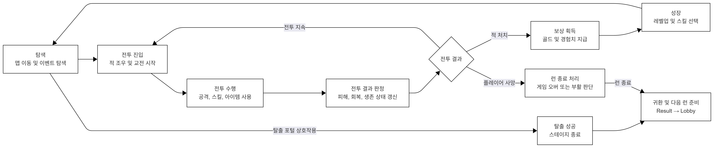
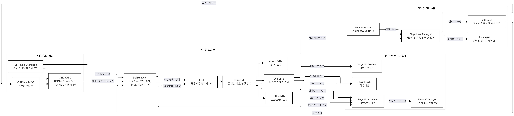

# Ashborn - 클라이언트 포트폴리오

Ashborn의 Unity 클라이언트 시스템 및 게임플레이 구현을 중심으로 정리한 공개 기술 포트폴리오 저장소입니다.

---

## 개요

Ashborn은 로그라이크 스킬 선택 시스템을 갖춘 모바일 탑다운 액션 게임입니다.

이 저장소는 출시 버전 전체를 공개한 프로젝트가 아니라, **클라이언트 코드 구조와 구현 방식**을 보여주기 위해 별도로 정리한 공개 포트폴리오 저장소입니다.

출시 버전에 포함된 상용 에셋, 라이선스 리소스, 모델, 애니메이션, 오디오, 프리팹, 씬 등은 공개 저장소에 포함하지 않았습니다.
따라서 이 저장소는 **전체 실행용 프로젝트가 아니라 코드 중심 기술 포트폴리오**를 목적으로 구성되어 있습니다.

---

## 프로젝트 정보

| 항목 | 내용 |
|------|------|
| 개발 인원 | 1인 (본인) |
| 제작 기간 | 약 6주 (2025.12.01 – 2026.01.14) |
| 개발 언어 / 엔진 | Unity + C# |
| Unity 버전 | 6000.2.4f1 |
| 타겟 플랫폼 | Android (모바일) |

---

## 시스템 아키텍처

### 전체 게임 구조



### 스킬 시스템 구조



### 인벤토리 구조


> 세부 구조 설명 자료는 `Docs/architecture/` 경로에 정리했습니다.

---

## 포함된 내용

- Unity 클라이언트 스크립트
- 게임플레이 시스템 관련 코드
- 플레이어 / 적 / 스킬 / 아이템 / UI / 매니저 구조
- 일부 기술 문서 및 구조 설명 자료
- 스크린샷 및 시연 링크 문서

---

## 제외된 내용

- 상용 에셋
- 라이선스가 있는 모델, 애니메이션, 텍스처, 오디오
- 전체 Unity 씬 및 프리팹
- 재배포가 어려운 외부 리소스
- 실행 빌드에 포함되던 일부 종속 리소스

---

## 저장소 구조

```text
ashborn-client-portfolio/
├─ Assets/
│  └─ Scripts/
│     ├─ Ads/
│     ├─ Constants/
│     ├─ Controller/
│     ├─ DTO/
│     ├─ Enemy/
│     ├─ Enums/
│     ├─ Interface/
│     ├─ Item/
│     ├─ Managers/
│     ├─ Map/
│     ├─ Object/
│     ├─ Player/
│     ├─ Skills/
│     ├─ SO/
│     ├─ Sound/
│     ├─ UI/
│     └─ Utility.cs
├─ Docs/
│  ├─ screenshots/
│  ├─ architecture/
│  └─ videos.md
├─ README.md
└─ .gitignore
```

---

## 스크립트 구조 설명

| 폴더 | 설명 |
|------|------|
| `Ads` | 보상형 광고, 전면 광고 등 광고 흐름 처리 및 관련 연동 코드 |
| `Constants` | 프로젝트 전반에서 공통으로 사용하는 상수 및 설정값 |
| `Controller` | 게임플레이 관련 주요 제어 로직 |
| `DTO` | 구조화된 데이터 전달을 위한 객체 |
| `Enemy` | 적 AI, 적 행동, 적 상태, 전투 관련 로직 |
| `Enums` | 게임 상태 및 시스템 전반에서 사용하는 열거형 정의 |
| `Interface` | 공통 역할 분리 및 재사용 가능한 구조를 위한 인터페이스 |
| `Item` | 아이템 관련 로직 및 아이템 시스템 |
| `Managers` | 게임 흐름, 상태, 공용 시스템을 관리하는 핵심 매니저 |
| `Map` | 맵 및 스테이지 관련 로직 |
| `Object` | 프로젝트 내 오브젝트 관련 게임플레이 로직 |
| `Player` | 플레이어 조작, 상태, 상호작용 등 플레이어 관련 핵심 로직 |
| `Skills` | 스킬 동작, 스킬 처리, 실행 관련 시스템 |
| `SO` | ScriptableObject 기반 데이터 정의 |
| `Sound` | 오디오 재생 및 사운드 관리 관련 로직 |
| `UI` | UI 흐름, UI 제어, 화면 구성 관련 로직 |
| `Utils.cs` | 여러 시스템에서 공통으로 사용하는 보조 메서드 |

---

## 기술적으로 중점 둔 부분

- Unity 클라이언트 구조 설계
- 게임플레이 시스템 구현
- 플레이어 / 적 시스템 구성
- 스킬 및 아이템 처리 로직
- UI 흐름 및 매니저 기반 구조
- 기능별 책임 분리를 통한 유지보수 가능한 코드 구조

---

## 담당한 내용

- Unity와 C# 기반 클라이언트 게임플레이 로직 구현
- 기능 단위 기준의 스크립트 구조 설계
- 플레이어, 적, 스킬, 아이템, UI 관련 시스템 구성
- 공용 매니저 중심의 흐름 및 상태 관리
- 실제 출시 프로젝트에서 사용된 일부 시스템의 구조 정리

---

## 스크린샷

### 타이틀 / 메인 화면

<!-- 스크린샷 추가 예정 -->

### 게임플레이

<!-- 스크린샷 추가 예정 -->

### UI

<!-- 스크린샷 추가 예정 -->

---

## 시연 링크

- **itch.io** : [Ash:born 링크](https://lookiesr.itch.io/ashborn)
- **YouTube** : 링크 추가 예정

> 추가 영상이나 참고 링크는 [`Docs/videos.md`](Docs/videos.md)에 정리되어 있습니다.

---

## 참고 사항

이 저장소에 포함된 일부 스크립트는 실제 출시 프로젝트의 구조와 흐름을 기준으로 정리되어 있습니다.
다만 출시 버전에 사용된 상용 에셋 및 라이선스 리소스는 공개 저장소에 포함하지 않았습니다.

따라서 이 저장소는 **전체 실행 가능한 공개 버전을 목적으로 하지 않으며**,
코드 구조, 구현 방식, 시스템 설계 역량을 보여주기 위한 **기술 포트폴리오**를 목적으로 합니다.

---

## 저장소 목적

이 저장소는 포트폴리오 및 기술 검토를 위한 용도로 제작되었습니다.

- 프로젝트 스크립트 구조를 보여주기 위함
- 게임플레이 시스템 구현 방식을 정리하기 위함
- Unity 클라이언트 로직 구성 방식을 보여주기 위함
- 기능별 책임 분리 및 코드 구조를 설명하기 위함
