<div align="center">

# ASH:BORN

### Unity 모바일 탑다운 액션 게임 · 클라이언트 포트폴리오

전투, 로그라이크 스킬 성장, 아이템 파밍, 인벤토리·장비, 상점, 영구 강화, 탈출과 결과 정산까지 구현한 1인 개발 프로젝트입니다.

<p>
  
  
  
  
  
</p>

[플레이 빌드](https://lookiesr.itch.io/ashborn) · [기능과 코드](#기능과-코드-연결) · [아키텍처](#아키텍처) · [성능 최적화](#성능-최적화) · [트러블슈팅](#트러블슈팅) · [코드 구조](#코드-구조)

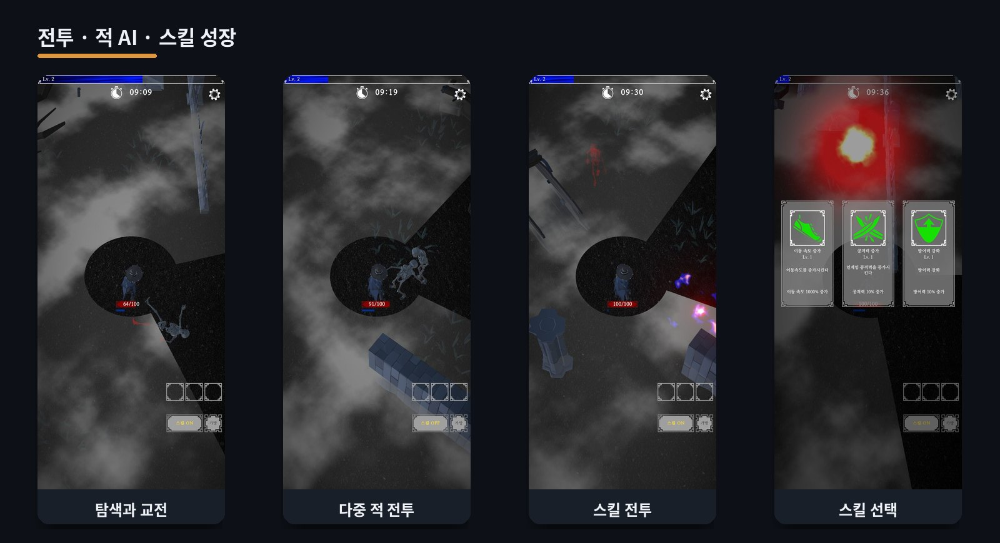

</div>

---

## 프로젝트 개요

**ASH:BORN**은 제한 시간 동안 던전을 탐색하고 적을 처치해 성장한 뒤, 획득한 아이템과 골드를 가지고 탈출하는 모바일 탑다운 액션 게임입니다.

이 저장소는 출시 프로젝트 전체가 아니라, 실제 게임에서 사용한 **Unity 클라이언트 코드와 시스템 설계**를 검토할 수 있도록 정리한 공개 포트폴리오입니다. 상용 에셋, 모델, 애니메이션, 오디오, 씬과 프리팹은 라이선스 문제로 제외되어 단독 실행용 프로젝트는 아닙니다.

| 항목 | 내용 |
|---|---|
| 개발 인원 | 1인 개발 |
| 제작 기간 | 약 6주 · 2025.12.01 – 2026.01.14 |
| 엔진 | Unity 6000.2.4f1 |
| 언어 | C# |
| 플랫폼 | Android · 세로 화면 |
| 장르 | 탑다운 액션 · 로그라이크 성장 · 익스트랙션 |
| AI 활용 | 의사결정과 기획 보조에 한정하여 사용했으며, 전반적인 코드 개발은 AI 도움을 거의 받지 않고 직접 수행 |

> AI는 의사결정과 기획을 정리하는 보조 도구로만 제한적으로 사용했습니다. 게임의 전반적인 코드 설계와 구현은 AI의 도움을 거의 받지 않고 직접 개발했습니다.

---

## 핵심 게임 루프

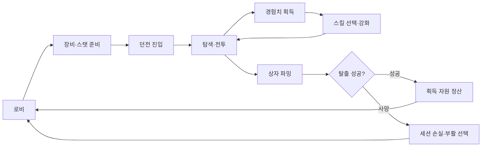
```mermaid
flowchart LR
    A[로비] --> B[장비·스탯 준비]
    B --> C[던전 진입]
    C --> D[탐색·전투]
    D --> E[경험치 획득]
    E --> F[스킬 선택·강화]
    F --> D
    D --> G[상자 파밍]
    G --> H{탈출 성공?}
    H -- 성공 --> I[획득 자원 정산]
    H -- 사망 --> J[세션 손실·부활 선택]
    I --> A
    J --> A
```

---

## 기능과 코드 연결

### 1. 로비 · 인벤토리 · 상점 · 영구 성장

<p align="center">
  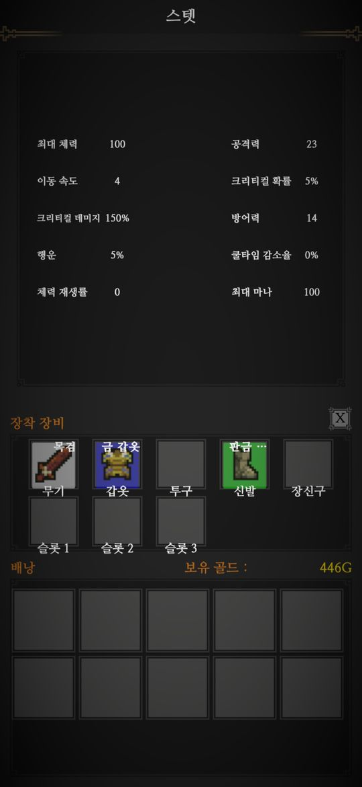
  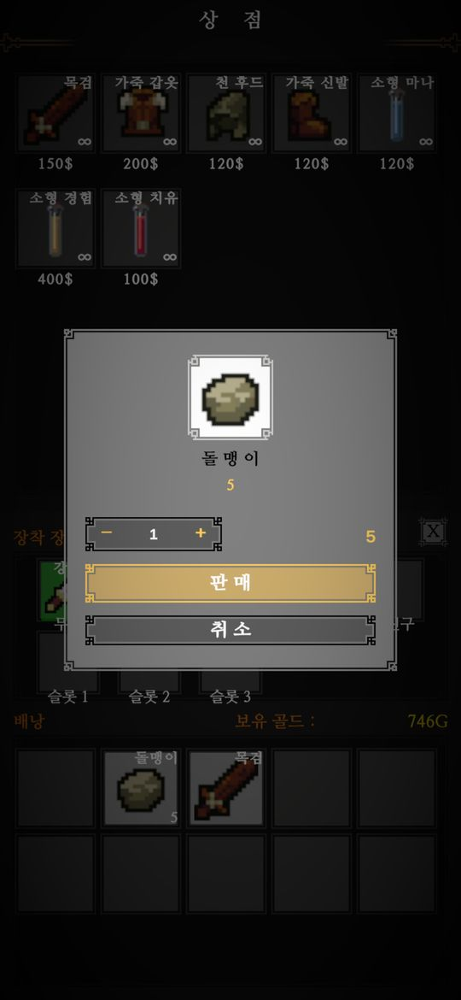
</p>

| 화면/기능 | 구현 흐름 | 핵심 코드 |
|---|---|---|
| 메인 로비 | 버튼 입력을 게임 상태 전환, 설정, 강화 UI와 연결 | [`LobbyUIManager`](Assets/Scripts/UI/LobbyUIManager.cs), [`GameManager`](Assets/Scripts/Managers/GameManager.cs) |
| 인벤토리 | 슬롯 데이터와 UI를 분리하고 변경 이벤트로 화면 갱신 | [`InventoryManager`](Assets/Scripts/Managers/InventoryManager.cs) |
| 장비 | 장착 슬롯별 아이템 관리, 장착·해제 시 런타임 스탯 반영 | [`EquipmentManager`](Assets/Scripts/Managers/EquipmentManager.cs), [`EquipItemHandler`](Assets/Scripts/Item/EquipItemHandler.cs) |
| 상점 | 재고·가격·인벤토리 여유 공간을 검증한 뒤 재화 차감과 아이템 지급 | [`ShopController`](Assets/Scripts/Controller/ShopController.cs), [`PlayerWallet`](Assets/Scripts/Player/PlayerWallet.cs) |
| 아이템 판매 | 인스턴스 GUID로 대상 아이템을 제거하고 판매 금액을 지급 | [`ShopController`](Assets/Scripts/Controller/ShopController.cs), [`InventoryManager`](Assets/Scripts/Managers/InventoryManager.cs) |
| 스탯 강화 | ScriptableObject에 레벨별 비용·증가량을 정의하고 최종 스탯을 합산 | [`PlayerStatUpgradeConfigSO`](Assets/Scripts/SO/Script/PlayerStatUpgradeConfigSO.cs), [`PlayerStatSystem`](Assets/Scripts/Player/PlayerStatSystem.cs) |
| 설정 | 오디오 믹서, FPS, 조이스틱 모드를 저장하고 씬 전환 후 복구 | [`SettingManager`](Assets/Scripts/Managers/SettingManager.cs) |

#### 아이템 데이터 흐름

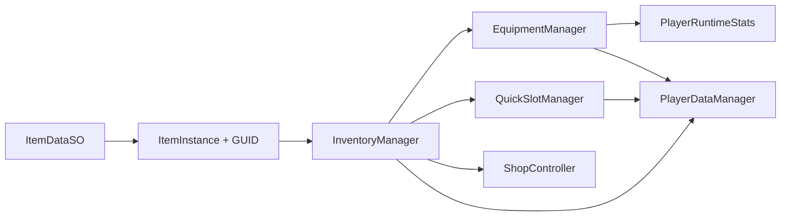
```mermaid
flowchart LR
    SO[ItemDataSO] --> INST[ItemInstance + GUID]
    INST --> INV[InventoryManager]
    INV --> EQ[EquipmentManager]
    INV --> QS[QuickSlotManager]
    INV --> SHOP[ShopController]
    EQ --> STAT[PlayerRuntimeStats]
    INV --> SAVE[PlayerDataManager]
    EQ --> SAVE
    QS --> SAVE
```

- 아이템 원형 데이터는 `ScriptableObject`로 관리합니다.
- 인벤토리에 들어온 아이템은 `ItemInstance`로 생성되며, 각 인스턴스에 `Guid`를 부여합니다.
- 장비와 퀵슬롯은 슬롯 번호가 아니라 인스턴스 식별자를 기준으로 참조하여 아이템 이동과 삭제를 추적합니다.
- `PlayerDataManager`는 골드, 인벤토리, 장착 아이템, 퀵슬롯, 영구 스탯 레벨을 JSON으로 저장합니다.

---

### 2. 실시간 전투 · 적 AI · 로그라이크 스킬 성장


| 시스템 | 구현 방식 | 핵심 코드 |
|---|---|---|
| 플레이어 전투 상태 | 이동, 체력, 애니메이션, 런타임 스탯을 개별 컴포넌트로 분리 | [`Player`](Assets/Scripts/Player/Player.cs), [`PlayerStateMachine`](Assets/Scripts/Player/PlayerStateMachine.cs), [`PlayerHealth`](Assets/Scripts/Player/PlayerHealth.cs) |
| 적 AI | 탐지, 추적, 배회, 공격 선택, 피해·사망 처리를 행동 단위 클래스로 분리 | [`EnemyController`](Assets/Scripts/Enemy/EnemyController.cs), [`EnemyDetection`](Assets/Scripts/Enemy/EnemyDetection.cs), [`Enemy/Node`](Assets/Scripts/Enemy/Node) |
| 공격 전략 | 근접과 투사체 공격을 공통 전략 인터페이스 아래 분리 | [`BaseStrategy`](Assets/Scripts/Enemy/Strategy/BaseStrategy.cs), [`MeleeAttack`](Assets/Scripts/Enemy/Strategy/MeleeAttack.cs), [`ProjectileAttack`](Assets/Scripts/Enemy/Strategy/ProjectileAttack.cs) |
| 스킬 런타임 | 데이터의 구현 타입을 실제 `ISkill` 컴포넌트로 생성하고 수명주기와 레벨을 관리 | [`SkillManager`](Assets/Scripts/Managers/SkillManager.cs), [`ISkill`](Assets/Scripts/Interface/ISkill.cs) |
| 레벨업 선택 | 경험치 초과분을 보존하고, 최대 레벨이 아닌 스킬 중 무작위 후보를 제시 | [`PlayerLevelManager`](Assets/Scripts/Managers/PlayerLevelManager.cs), [`PlayerProgress`](Assets/Scripts/Player/PlayerProgress.cs) |
| 성능 대응 | 투사체·파티클 재사용과 원거리 적 갱신 제어를 별도 관리 | [`ObjectPoolManager`](Assets/Scripts/Managers/ObjectPoolManager.cs), [`EnemyCullingManager`](Assets/Scripts/Managers/EnemyCullingManager.cs) |

#### 스킬 생성과 레벨업

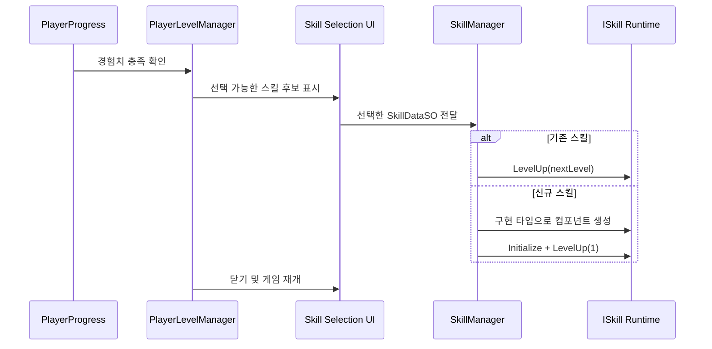
```mermaid
sequenceDiagram
    participant Progress as PlayerProgress
    participant Level as PlayerLevelManager
    participant UI as Skill Selection UI
    participant Skill as SkillManager
    participant Runtime as ISkill Runtime

    Progress->>Level: 경험치 충족 확인
    Level->>UI: 선택 가능한 스킬 후보 표시
    UI->>Skill: 선택한 SkillDataSO 전달
    alt 기존 스킬
        Skill->>Runtime: LevelUp(nextLevel)
    else 신규 스킬
        Skill->>Runtime: 구현 타입으로 컴포넌트 생성
        Skill->>Runtime: Initialize + LevelUp(1)
    end
    Level->>UI: 닫기 및 게임 재개
```

`SkillManager`는 개별 스킬의 공격 로직을 직접 수행하지 않고, 스킬 생성·레벨·활성 상태·마나와 같은 공통 수명주기를 관리합니다. 실제 동작은 `ISkill` 구현체로 분리하여 신규 스킬을 추가할 때 기존 매니저의 수정 범위를 제한했습니다.

---

### 3. 상호작용 · 상자 · 아이템 전송

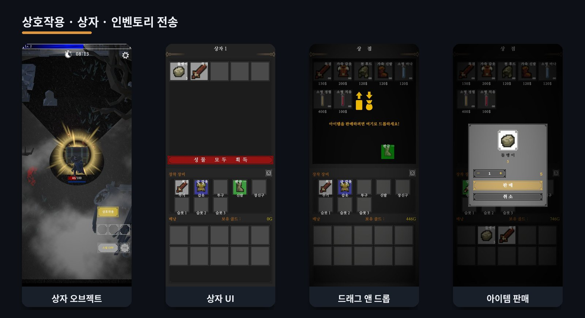

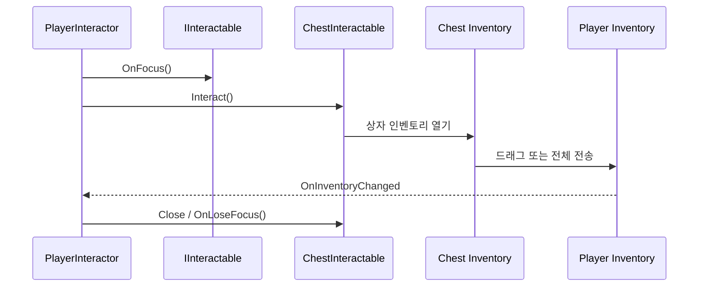
```mermaid
sequenceDiagram
    participant Player as PlayerInteractor
    participant Target as IInteractable
    participant Chest as ChestInteractable
    participant ChestInv as Chest Inventory
    participant PlayerInv as Player Inventory

    Player->>Target: OnFocus()
    Player->>Chest: Interact()
    Chest->>ChestInv: 상자 인벤토리 열기
    ChestInv->>PlayerInv: 드래그 또는 전체 전송
    PlayerInv-->>Player: OnInventoryChanged
    Player->>Chest: Close / OnLoseFocus()
```

- 상자, 문, NPC, 상점처럼 상호작용 가능한 대상을 [`IInteractable`](Assets/Scripts/Interface/IInteractable.cs)로 추상화했습니다.
- [`ChestInteractable`](Assets/Scripts/Object/ChestInteractable.cs)은 상자 애니메이션과 UI 열기·닫기만 담당합니다.
- 실제 슬롯 교환, 스택 병합, 다른 인벤토리로 전송하는 규칙은 [`InventoryManager`](Assets/Scripts/Managers/InventoryManager.cs)에 모았습니다.
- 상자 인벤토리는 가중치 드롭 테이블을 이용해 아이템과 수량을 생성합니다.

---

### 4. 탈출 · 사망 · 결과 정산

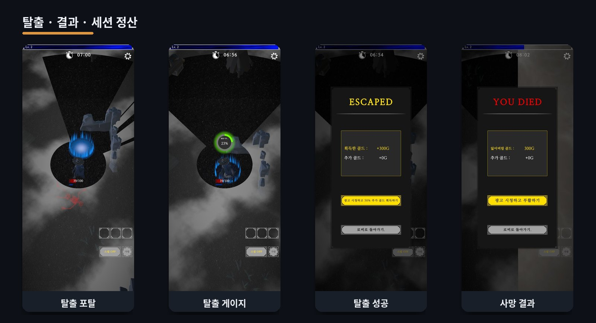

| 단계 | 구현 내용 | 핵심 코드 |
|---|---|---|
| 포탈 진입 | 플레이어 레이어 진입 여부를 감지하고 탈출 UI 활성화 | [`EscapePortal3D`](Assets/Scripts/Object/EscapePortal.cs) |
| 탈출 게이지 | 포탈 내부 체류 시간을 누적하고 이탈 시 게이지를 감소 | [`EscapePortal3D`](Assets/Scripts/Object/EscapePortal.cs), [`InGameHUDController`](Assets/Scripts/UI/InGameHUDController.cs) |
| 탈출 성공 | 게임 상태를 결과로 전환하고 성공 결과 UI 표시 | [`InGameManager`](Assets/Scripts/Managers/InGameManager.cs), [`GameManager`](Assets/Scripts/Managers/GameManager.cs) |
| 사망 | 플레이어 사망 이벤트를 구독해 부활 가능 여부와 데이터 초기화를 분기 | [`PlayerHealth`](Assets/Scripts/Player/PlayerHealth.cs), [`InGameManager`](Assets/Scripts/Managers/InGameManager.cs) |
| 결과 정산 | 탈출 여부에 따라 세션 아이템 초기화와 골드 정산 정책 적용 | [`GameManager`](Assets/Scripts/Managers/GameManager.cs), [`PlayerWallet`](Assets/Scripts/Player/PlayerWallet.cs) |
| 결과 UI | HUD, 인벤토리, 결과 패널과 `Time.timeScale`을 전역 UI 루트에서 조정 | [`UIManager`](Assets/Scripts/Managers/UIManager.cs) |

게임 종료는 UI에서 직접 씬을 변경하지 않습니다. `InGameManager`가 전투 세션 결과를 판정하고, `GameManager`가 상태 전환·정산·씬 이동을 수행하며, `UIManager`는 결과 화면과 일시정지만 담당하도록 역할을 나눴습니다.

---

## 아키텍처

기존 PNG 다이어그램 대신 **실제 소스 코드의 클래스와 책임을 기준으로 작성한 Mermaid 원본**을 포함했습니다. GitHub에서 바로 렌더링되며, 별도 이미지 파일 없이 수정할 수 있습니다.

> 더 상세한 책임 설명과 독립 `.mmd` 원본은 [`Docs/architecture/README.md`](Docs/architecture/README.md)에서 확인할 수 있습니다.

### 1. 전체 클라이언트 흐름

`GameManager`가 로비·인게임·결과 상태를 전환하고, `InGameManager`가 한 번의 던전 세션을 관리합니다. 플레이어, 적, 스킬, 인벤토리는 인게임에서 동작하며, 저장·설정·광고 시스템은 씬 전환을 넘어 유지되는 전역 흐름으로 분리했습니다.

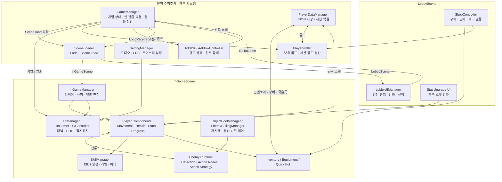
```mermaid
flowchart TD
    subgraph Persistent["전역 수명주기 · 영구 시스템"]
        GM["GameManager<br/>게임 상태 · 씬 전환 요청 · 결과 정산"]
        SCENE["SceneLoader<br/>Fade · Scene Load"]
        PDM["PlayerDataManager<br/>JSON 저장 · 세션 복원"]
        WALLET["PlayerWallet<br/>보유 골드 · 세션 골드 정산"]
        SET["SettingManager<br/>오디오 · FPS · 조이스틱 설정"]
        ADS["AdSDK / AdFlowController<br/>광고 상태 · 완료 콜백"]
    end

    subgraph Lobby["LobbyScene"]
        LUI["LobbyUIManager<br/>던전 진입 · 강화 · 설정"]
        SHOP["ShopController<br/>구매 · 판매 · 재고 검증"]
        UPGRADE["Stat Upgrade UI<br/>영구 스탯 강화"]
    end

    subgraph InGame["InGameScene"]
        IGM["InGameManager<br/>타이머 · 사망 · 탈출 판정"]
        PLAYER["Player Components<br/>Movement · Health · Stats · Progress"]
        ENEMY["Enemy Runtime<br/>Detection · Action Nodes · Attack Strategy"]
        SKILL["SkillManager<br/>ISkill 생성 · 레벨 · 마나"]
        ITEM["Inventory / Equipment / QuickSlot"]
        UI["UIManager / InGameHUDController<br/>패널 · HUD · 일시정지"]
        PERF["ObjectPoolManager / EnemyCullingManager<br/>재사용 · 갱신 범위 제어"]
    end

    LUI -->|"GoToGame"| GM
    GM -->|"Scene load 요청"| SCENE
    SCENE -->|"InGameScene"| IGM
    IGM --> PLAYER
    PLAYER <-->|"전투"| ENEMY
    PLAYER --> SKILL
    PLAYER --> ITEM
    IGM --> UI
    PERF --> ENEMY

    SHOP --> ITEM
    SHOP --> WALLET
    UPGRADE --> PLAYER
    PDM <-->|"인벤토리 · 장비 · 퀵슬롯"| ITEM
    PDM <-->|"골드"| WALLET
    PDM <-->|"영구 스탯"| PLAYER
    GM -->|"사망 / 탈출"| UI
    GM -->|"EndStage"| WALLET
    GM -->|"스테이지 종료"| ADS
    ADS -->|"완료 콜백"| GM
    GM -->|"LobbyScene 요청"| SCENE
    SCENE -->|"LobbyScene"| LUI
    SET --> UI
```

### 2. 인벤토리 · 장비 · 퀵슬롯 구조

아이템 원형은 `ItemDataSO`, 실제 획득 아이템은 GUID를 가진 `ItemInstance`로 분리했습니다. `InventoryManager`가 스택·교환·전송 규칙을 소유하고, 장비·퀵슬롯·상점·상자·저장 시스템은 동일한 런타임 아이템 모델을 참조합니다.

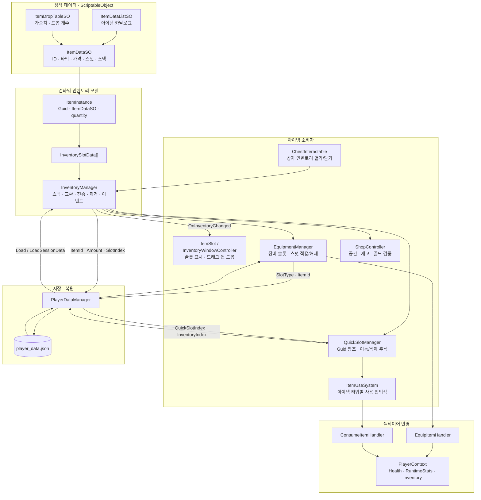
```mermaid
flowchart TD
    subgraph StaticData["정적 데이터 · ScriptableObject"]
        LIST["ItemDataListSO<br/>아이템 카탈로그"]
        ITEMSO["ItemDataSO<br/>ID · 타입 · 가격 · 스탯 · 스택"]
        DROP["ItemDropTableSO<br/>가중치 · 드롭 개수"]
        LIST --> ITEMSO
        DROP --> ITEMSO
    end

    subgraph RuntimeModel["런타임 인벤토리 모델"]
        INSTANCE["ItemInstance<br/>Guid · ItemDataSO · quantity"]
        SLOTDATA["InventorySlotData[]"]
        INV["InventoryManager<br/>스택 · 교환 · 전송 · 제거 · 이벤트"]
        ITEMSO --> INSTANCE
        INSTANCE --> SLOTDATA
        SLOTDATA --> INV
    end

    subgraph Consumers["아이템 소비자"]
        SLOTUI["ItemSlot / InventoryWindowController<br/>슬롯 표시 · 드래그 앤 드롭"]
        EQUIP["EquipmentManager<br/>장비 슬롯 · 스탯 적용/해제"]
        QUICK["QuickSlotManager<br/>Guid 참조 · 이동/삭제 추적"]
        SHOP["ShopController<br/>공간 · 재고 · 골드 검증"]
        CHEST["ChestInteractable<br/>상자 인벤토리 열기/닫기"]
        USE["ItemUseSystem<br/>아이템 타입별 사용 진입점"]
    end

    INV -->|"OnInventoryChanged"| SLOTUI
    INV --> EQUIP
    INV --> QUICK
    INV --> SHOP
    CHEST --> INV
    QUICK --> USE

    subgraph PlayerEffect["플레이어 반영"]
        EQUIP_HANDLER["EquipItemHandler"]
        CONSUME_HANDLER["ConsumeItemHandler"]
        CONTEXT["PlayerContext<br/>Health · RuntimeStats · Inventory"]
        EQUIP --> EQUIP_HANDLER
        USE --> CONSUME_HANDLER
        EQUIP_HANDLER --> CONTEXT
        CONSUME_HANDLER --> CONTEXT
    end

    subgraph Persistence["저장 · 복원"]
        PDM["PlayerDataManager"]
        JSON[("player_data.json")]
        INV -->|"ItemId · Amount · SlotIndex"| PDM
        EQUIP -->|"SlotType · ItemId"| PDM
        QUICK -->|"QuickSlotIndex · InventoryIndex"| PDM
        PDM --> JSON
        JSON --> PDM
        PDM -->|"Load / LoadSessionData"| INV
        PDM --> EQUIP
        PDM --> QUICK
    end
```

### 3. 스킬 · 레벨업 성장 구조

`PlayerProgress`가 경험치와 레벨을 보유하고, `PlayerLevelManager`가 레벨업 조건과 후보 UI를 관리합니다. 선택된 `SkillDataSO`는 `SkillManager`로 전달되며, 신규 스킬이면 구현 타입에 맞는 `ISkill` 컴포넌트를 생성하고 기존 스킬이면 현재 인스턴스의 레벨만 올립니다.

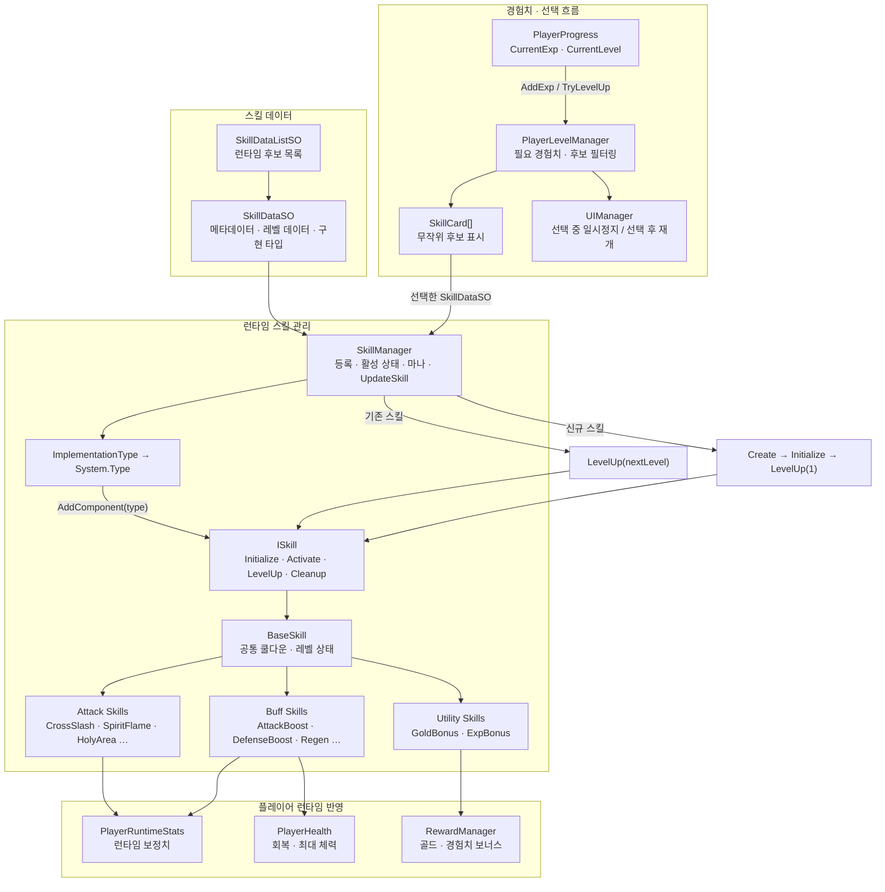
```mermaid
flowchart TD
    subgraph SkillData["스킬 데이터"]
        LIST["SkillDataListSO<br/>런타임 후보 목록"]
        DATA["SkillDataSO<br/>메타데이터 · 레벨 데이터 · 구현 타입"]
        LIST --> DATA
    end

    subgraph Progression["경험치 · 선택 흐름"]
        PROGRESS["PlayerProgress<br/>CurrentExp · CurrentLevel"]
        LEVEL["PlayerLevelManager<br/>필요 경험치 · 후보 필터링"]
        CARD["SkillCard[]<br/>무작위 후보 표시"]
        UIM["UIManager<br/>선택 중 일시정지 / 선택 후 재개"]
        PROGRESS -->|"AddExp / TryLevelUp"| LEVEL
        LEVEL --> CARD
        LEVEL --> UIM
    end

    subgraph Runtime["런타임 스킬 관리"]
        MANAGER["SkillManager<br/>등록 · 활성 상태 · 마나 · UpdateSkill"]
        TYPEMAP["ImplementationType → System.Type"]
        CONTRACT["ISkill<br/>Initialize · Activate · LevelUp · Cleanup"]
        BASE["BaseSkill<br/>공통 쿨다운 · 레벨 상태"]
        ATTACK["Attack Skills<br/>CrossSlash · SpiritFlame · HolyArea …"]
        BUFF["Buff Skills<br/>AttackBoost · DefenseBoost · Regen …"]
        UTILITY["Utility Skills<br/>GoldBonus · ExpBonus"]

        MANAGER --> TYPEMAP
        TYPEMAP -->|"AddComponent(type)"| CONTRACT
        CONTRACT --> BASE
        BASE --> ATTACK
        BASE --> BUFF
        BASE --> UTILITY
    end

    DATA --> MANAGER
    CARD -->|"선택한 SkillDataSO"| MANAGER
    MANAGER -->|"기존 스킬"| EXISTING["LevelUp(nextLevel)"]
    MANAGER -->|"신규 스킬"| NEW["Create → Initialize → LevelUp(1)"]
    EXISTING --> CONTRACT
    NEW --> CONTRACT

    subgraph PlayerRuntime["플레이어 런타임 반영"]
        STATS["PlayerRuntimeStats<br/>런타임 보정치"]
        HEALTH["PlayerHealth<br/>회복 · 최대 체력"]
        REWARD["RewardManager<br/>골드 · 경험치 보너스"]
        ATTACK --> STATS
        BUFF --> STATS
        BUFF --> HEALTH
        UTILITY --> REWARD
    end
```

### Mermaid 원본 파일

- [`client-flow.mmd`](Docs/architecture/client-flow.mmd)
- [`inventory-system.mmd`](Docs/architecture/inventory-system.mmd)
- [`skill-system.mmd`](Docs/architecture/skill-system.mmd)

---

## 기술적 구현 포인트

### 데이터와 런타임 상태 분리

정적 설정은 `ScriptableObject`, 플레이 중 변경되는 값은 런타임 객체로 분리했습니다. 아이템과 스킬의 밸런스 데이터를 코드 수정 없이 조정할 수 있고, 동일한 원형 데이터를 사용하는 아이템도 각 인스턴스의 수량과 식별자를 별도로 유지합니다.

### 이벤트 기반 UI 갱신

인벤토리, 골드, 마나, 타이머, 플레이어 사망과 같은 변경 사항을 이벤트로 전달합니다. UI가 매 프레임 값을 조회하지 않고 변경 시점에만 갱신되도록 구성했습니다.

```text
InventoryManager.OnInventoryChanged ──> ItemSlot.Refresh
PlayerWallet.OnGoldChanged ───────────> LobbyUIManager
SkillManager.OnManaChanged ───────────> InGame HUD
InGameManager.OnSecondElapsed ────────> Timer UI
PlayerHealth.OnKilled ────────────────> InGameManager
```

### 저장과 세션 데이터

[`PlayerDataManager`](Assets/Scripts/Managers/PlayerDataManager.cs)는 `Application.persistentDataPath`에 JSON을 저장합니다. 영구 저장 데이터와 씬 사이에서 유지할 세션 데이터를 별도로 관리하여 로비와 인게임 전환 과정에서 장비·인벤토리·퀵슬롯 참조를 복원합니다.

### 외부 SDK 격리

광고 SDK 초기화와 광고 종류별 상태를 [`AdSDK`](Assets/Scripts/Ads/AdSDK.cs), [`RewardedAdHandler`](Assets/Scripts/Ads/RewardedAdHandler.cs), [`InterstitialAdHandler`](Assets/Scripts/Ads/InterstitialAdHandler.cs)로 분리했습니다. 게임 흐름은 [`AdFlowController`](Assets/Scripts/Controller/AdFlowController.cs)를 통해 광고 완료 콜백만 전달받습니다.

---


## 성능 최적화

모바일 환경에서 다수의 적, 투사체, 스킬 이펙트와 넓은 맵을 동시에 처리해야 했기 때문에, 반복 생성 비용과 매 프레임 갱신 범위를 줄이는 방향으로 최적화했습니다.

> 공개 저장소에는 Unity Profiler 측정 자료가 포함되어 있지 않아 임의의 FPS·GC 개선 수치는 기재하지 않았습니다. 아래 내용은 실제 코드에서 확인할 수 있는 적용 방식입니다.

### 1. 적·투사체·스킬 이펙트 오브젝트 풀링

[`ObjectPoolManager`](Assets/Scripts/Managers/ObjectPoolManager.cs)는 `poolId`별 `Queue<GameObject>`를 유지하고, 시작 시 설정된 수량을 미리 생성합니다. 전투 중에는 풀에서 객체를 꺼내 재사용하고 사용이 끝난 객체는 비활성화하여 다시 반환합니다.

- 적과 반복 사용 프리팹의 `Instantiate`·`Destroy` 호출 감소
- [`PooledObject`](Assets/Scripts/Object/PooledObject.cs)가 자신이 속한 풀을 기억하고 반환 요청 처리
- [`EnemySpawner`](Assets/Scripts/Enemy/EnemySpawner.cs)가 적을 직접 생성하지 않고 등록된 풀에서 획득
- 스테이지 종료 시 활성화된 풀링 객체 일괄 회수
- 재사용되는 적은 [`EnemyController.OnSpawnInitialize`](Assets/Scripts/Enemy/EnemyController.cs)에서 체력, Collider, AI 상태와 탐지 참조 초기화

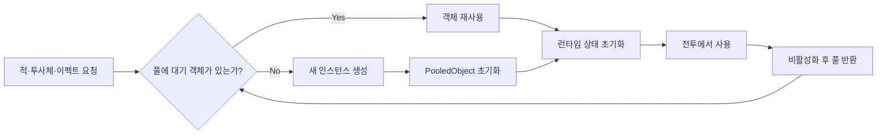
```mermaid
flowchart LR
    REQUEST["적·투사체·이펙트 요청"] --> POOL{"풀에 대기 객체가 있는가?"}
    POOL -- Yes --> REUSE["객체 재사용"]
    POOL -- No --> CREATE["새 인스턴스 생성"]
    CREATE --> INIT["PooledObject 초기화"]
    REUSE --> RESET["런타임 상태 초기화"]
    INIT --> RESET
    RESET --> ACTIVE["전투에서 사용"]
    ACTIVE --> RETURN["비활성화 후 풀 반환"]
    RETURN --> POOL
```

### 2. 플레이어 거리 기반 적 활성화

[`EnemyCullingManager`](Assets/Scripts/Managers/EnemyCullingManager.cs)는 카메라 프러스텀 판정이 아니라 **플레이어와 적 사이의 거리**를 기준으로 원거리 적을 비활성화합니다.

- `Vector3.Distance` 대신 `sqrMagnitude`와 거리 제곱값 비교
- 플레이어가 `updateThreshold` 이상 이동했을 때만 재검사
- 모든 적을 한 프레임에 처리하지 않고 `checksPerFrame` 단위로 분할
- 사망한 적은 활성화 검사에서 제외
- 원거리 적의 GameObject를 비활성화하여 AI, 애니메이션과 컴포넌트 갱신 중단

### 3. 타일 단위 맵 구성과 갱신 범위 제한

[`MapManager`](Assets/Scripts/Managers/MapManager.cs)는 맵을 하나의 거대한 오브젝트로 구성하지 않고 격자형 타일 단위로 생성합니다.

- 플레이어가 일정 거리 이상 이동했을 때만 주변 타일 후보 계산
- 플레이어의 현재 격자 좌표와 `activeRadius`를 이용해 검사 범위 제한
- 타일과 적 생성 이후 런타임에 필요한 참조 목록 정리
- NavMesh 생성이 끝난 뒤 적 배치를 시작하여 초기화 순서 분리

### 4. 대량 적 배치 작업의 프레임 분산

[`EnemySpawner.CoSpawnAllEnemies`](Assets/Scripts/Enemy/EnemySpawner.cs)는 전체 타일의 적을 한 프레임에 모두 배치하지 않습니다. 타일 하나의 스폰 처리가 끝날 때마다 `yield return null`로 다음 프레임에 작업을 이어가 초기 진입 시 순간 부하가 한 프레임에 집중되는 것을 줄였습니다.

### 5. 이벤트 기반 UI 갱신

HUD와 아이템 UI는 매 프레임 상태를 조회하지 않고 값이 변경된 시점에 갱신합니다.

```text
InventoryManager.OnInventoryChanged ──> 인벤토리 슬롯 갱신
InventoryManager.OnItemMoved ─────────> 퀵슬롯 참조 재바인딩
InventoryManager.OnItemRemoved ───────> 삭제된 퀵슬롯 참조 해제
SkillManager.OnManaChanged ───────────> 마나 UI 갱신
InGameManager.OnSecondElapsed ────────> 1초 단위 타이머 UI 갱신
PlayerWallet.OnGoldChanged ───────────> 골드 UI 갱신
```

마나는 화면에 표시되는 정수 값이 바뀔 때만 이벤트를 발생시키고, 타이머는 내부적으로 프레임마다 감소하더라도 UI에는 1초 단위로 전달합니다.

> 상세한 문제 해결 과정과 설계 판단은 [`Docs/technical/README.md`](Docs/technical/README.md)에 정리했습니다.

---

## 트러블슈팅

### 1. 일반 슬롯 하나로 인벤토리·장비·퀵슬롯을 모두 처리하려 했던 문제

#### 문제

초기에는 일반 아이템 슬롯 하나를 재사용하면 인벤토리, 장착 장비와 퀵슬롯을 모두 구현할 수 있다고 판단했습니다. 그러나 개발이 진행되면서 세 슬롯의 **데이터 소유 방식과 드롭 규칙이 서로 다르다**는 문제가 드러났습니다.

| 슬롯 | 역할과 소유권 |
|---|---|
| 일반 인벤토리 슬롯 | 실제 `ItemInstance`를 보관하고 스택, 교환, 인벤토리 간 전송 처리 |
| 장비 슬롯 | 장비 타입 검증, 장착·해제와 런타임 스탯 적용·제거 처리 |
| 퀵슬롯 | 아이템을 소유하지 않고 인벤토리 내부 소비 아이템의 `Guid`만 참조 |

하나의 슬롯에 모든 규칙을 넣을수록 출발 슬롯과 목적 슬롯 조합에 따른 조건 분기가 증가했습니다. 또한 퀵슬롯을 인벤토리 인덱스로 연결하면 아이템 이동이나 정렬 이후 다른 아이템을 가리킬 수 있었습니다.

#### 해결

- [`ItemSlot`](Assets/Scripts/UI/ItemSlot.cs)에 공통 표시, 드래그 앤 드롭 진입점과 일반 인벤토리 이동 규칙 배치
- [`EquipSlot`](Assets/Scripts/UI/EquipSlot.cs)에 장비 타입 검증, 장착 교환과 해제 규칙 분리
- [`QuickSlot`](Assets/Scripts/UI/QuickSlot.cs)은 아이템을 복제하지 않고 `ItemInstance.Guid`만 저장
- [`QuickSlotManager`](Assets/Scripts/Managers/QuickSlotManager.cs)가 아이템 이동·삭제 이벤트를 구독하여 참조 재바인딩 또는 해제
- [`EquipmentManager`](Assets/Scripts/Managers/EquipmentManager.cs)가 장착 데이터와 스탯 반영 책임 소유

#### 결과

공통 슬롯 UI는 재사용하면서도 슬롯별 소유권과 동작 규칙을 분리했습니다. 인벤토리에서 아이템 위치가 바뀌어도 퀵슬롯은 동일한 인스턴스를 추적하고, 아이템이 소모되거나 삭제되면 잘못된 참조를 유지하지 않습니다.

### 2. 제한된 맵 에셋으로 매 세션 다른 던전 구성하기

#### 문제

매 판 다른 넓은 던전을 제공하고 싶었지만, 완전한 절차적 지형 생성은 1인 개발 일정에서 제작·검증 비용이 컸습니다. 반대로 하나의 고정 맵만 사용하면 반복 플레이가 빠르게 단조로워졌습니다.

#### 해결

[`MapManager`](Assets/Scripts/Managers/MapManager.cs)에서 검증된 타일 프리팹을 격자로 배치하고 런타임에 조합했습니다.

- 필드 타일 프리팹 무작위 선택
- 각 타일을 `0°`, `90°`, `180°`, `270°` 중 하나로 회전
- 중심과의 거리에 따라 Easy, Middle, Hard, Boss 구역 배치
- 난이도 구역별 탈출 타일과 전체 후보 중 아이템 타일 무작위 선정
- 구역 난이도에 따라 서로 다른 적 풀 선택
- 타일 내부 스폰 지점과 적 회전 무작위화
- 맵 조합과 NavMesh 생성 후 적 배치 시작

#### 결과

완전한 절차적 생성보다 구현 범위와 검증 비용을 제한하면서도, 동일한 타일 에셋으로 매 세션의 진행 경로, 이벤트 위치와 적 구성이 달라지도록 만들었습니다.

### 3. 풀링된 적에게 이전 생명주기의 상태가 남는 문제

#### 문제

사망한 적을 단순히 비활성화했다가 다시 사용하면 체력, Collider, AI Blackboard 변수, 탐지 대상과 사망 처리 여부가 이전 상태로 남을 수 있었습니다.

#### 해결

[`EnemyController.OnSpawnInitialize`](Assets/Scripts/Enemy/EnemyController.cs)를 풀링 객체 재사용의 단일 진입점으로 두고 다음 상태를 명시적으로 복원했습니다.

- 체력과 사망 처리 플래그 초기화
- Collider Trigger 상태 복구
- Behavior Graph의 사망·의심·탐지 변수 초기화
- 플레이어 Target과 배회 지점 재설정
- 탐지 컴포넌트 참조 갱신
- NavMeshAgent 재활성화와 `Warp`를 통한 생성 위치 보정

#### 결과

생성과 파괴를 반복하지 않으면서도 풀에서 꺼낸 적을 새로 생성된 적과 동일한 초기 상태로 사용할 수 있도록 재사용 규칙을 명확히 했습니다.

> 상세 문서: [`Docs/technical/README.md`](Docs/technical/README.md)

---

## 기술 스택

| 구분 | 사용 기술 |
|---|---|
| Engine | Unity 6000.2.4f1 |
| Language | C# |
| UI | UGUI, TextMeshPro |
| Data | ScriptableObject, Newtonsoft.Json |
| Animation/UI Tween | DOTween |
| Monetization | Unity LevelPlay · Rewarded / Interstitial |
| Platform | Android |
| Version Control | Git, GitHub |

---

## 코드 구조

```text
Assets/Scripts/
├─ Ads/          # 광고 SDK 초기화와 광고 단위 상태 관리
├─ Constants/    # 씬 이름 등 공통 상수
├─ Controller/   # 씬, 상점, 보상 등 기능 흐름 조정
├─ DTO/          # 저장·런타임 전달 데이터
├─ Enemy/        # 적 AI, 공격 전략, 행동 노드
├─ Enums/        # 게임·아이템·스킬 상태 정의
├─ Interface/    # 상호작용, 데미지, 스킬 계약
├─ Item/         # 소비·장착·사용 처리
├─ Managers/     # 게임 상태, 인벤토리, 스킬, 저장, UI 관리
├─ Map/          # 맵과 타일 로직
├─ Object/       # 상자, 포탈, 투사체, 풀링 오브젝트
├─ Player/       # 이동, 체력, 상태, 스탯, 지갑
├─ Skills/       # 액티브·패시브 스킬 구현체
├─ SO/           # 아이템·적·플레이어·스킬 데이터
├─ Sound/        # 사운드 재생 제어
└─ UI/           # HUD, 슬롯, 모달, 결과 화면
```

### 빠르게 확인할 코드

| 관심 영역 | 시작 파일 |
|---|---|
| 전체 게임 흐름 | [`GameManager.cs`](Assets/Scripts/Managers/GameManager.cs), [`InGameManager.cs`](Assets/Scripts/Managers/InGameManager.cs) |
| 인벤토리·아이템 | [`InventoryManager.cs`](Assets/Scripts/Managers/InventoryManager.cs), [`EquipmentManager.cs`](Assets/Scripts/Managers/EquipmentManager.cs) |
| 스킬 성장 | [`SkillManager.cs`](Assets/Scripts/Managers/SkillManager.cs), [`PlayerLevelManager.cs`](Assets/Scripts/Managers/PlayerLevelManager.cs) |
| 적 AI | [`EnemyController.cs`](Assets/Scripts/Enemy/EnemyController.cs), [`EnemyDetection.cs`](Assets/Scripts/Enemy/EnemyDetection.cs) |
| 성능 최적화 | [`ObjectPoolManager.cs`](Assets/Scripts/Managers/ObjectPoolManager.cs), [`EnemyCullingManager.cs`](Assets/Scripts/Managers/EnemyCullingManager.cs), [`EnemySpawner.cs`](Assets/Scripts/Enemy/EnemySpawner.cs) |
| 맵 생성 | [`MapManager.cs`](Assets/Scripts/Managers/MapManager.cs), [`Tile.cs`](Assets/Scripts/Map/Tile.cs) |
| 슬롯 역할 분리 | [`ItemSlot.cs`](Assets/Scripts/UI/ItemSlot.cs), [`EquipSlot.cs`](Assets/Scripts/UI/EquipSlot.cs), [`QuickSlot.cs`](Assets/Scripts/UI/QuickSlot.cs) |
| 상자 상호작용 | [`IInteractable.cs`](Assets/Scripts/Interface/IInteractable.cs), [`ChestInteractable.cs`](Assets/Scripts/Object/ChestInteractable.cs) |
| 탈출·결과 | [`EscapePortal.cs`](Assets/Scripts/Object/EscapePortal.cs), [`UIManager.cs`](Assets/Scripts/Managers/UIManager.cs) |
| 저장·복원 | [`PlayerDataManager.cs`](Assets/Scripts/Managers/PlayerDataManager.cs) |

---

## 전체 스크린샷

> 원본 캡처와 합성 이미지 목록은 [`Docs/screenshots/portfolio/README.md`](Docs/screenshots/portfolio/README.md)에서 확인할 수 있습니다.

<details>
<summary><strong>아이템 · 인벤토리 · 상자</strong></summary>
<br />
<table>
<tr>
<td align="center"><br /><sub>인벤토리·장비</sub></td>
<td align="center"><br /><sub>아이템 판매</sub></td>
<td align="center">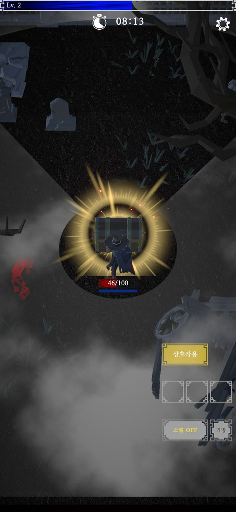<br /><sub>상자 오브젝트</sub></td>
<td align="center">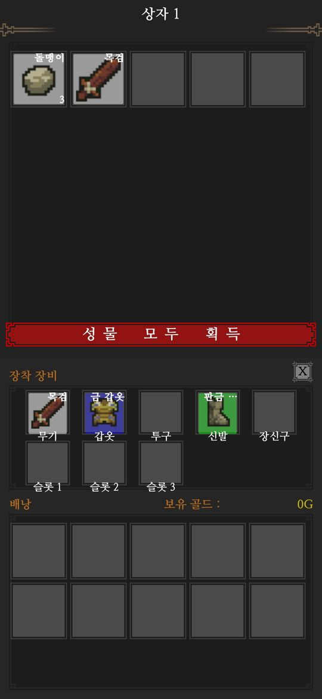<br /><sub>상자 인벤토리</sub></td>
</tr>
</table>
</details>

<details>
<summary><strong>전투 화면</strong></summary>
<br />
<table>
<tr>
<td align="center">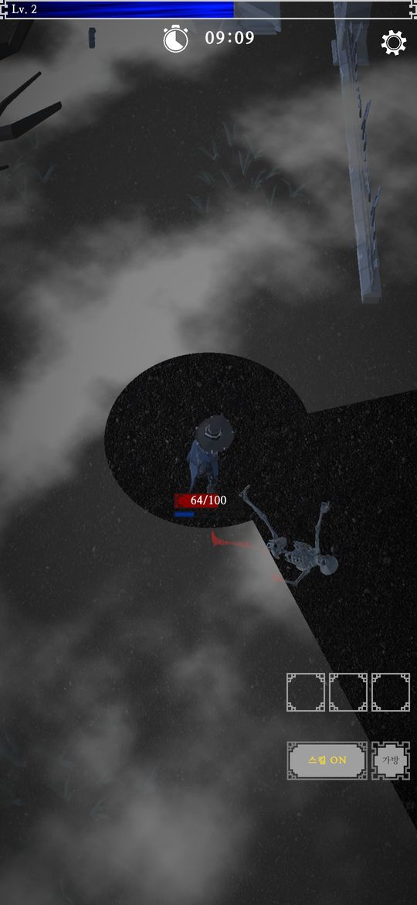<br /><sub>탐색과 교전</sub></td>
<td align="center">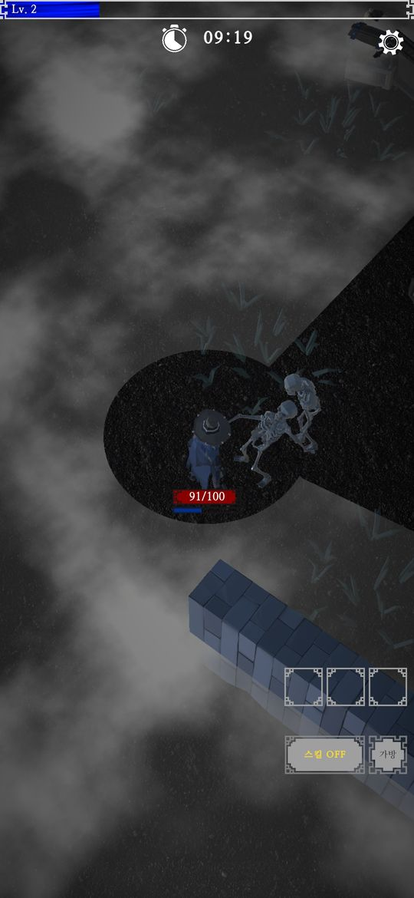<br /><sub>다중 적 전투</sub></td>
<td align="center">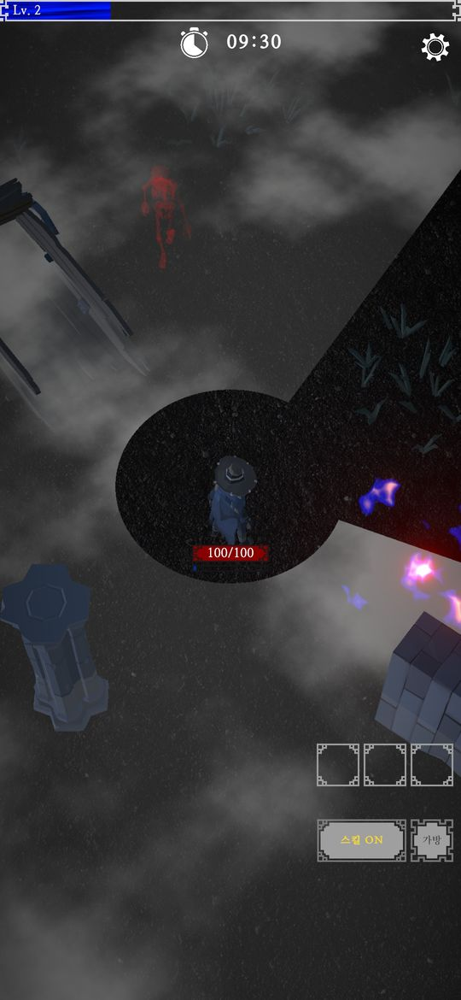<br /><sub>스킬 전투</sub></td>
<td align="center"><br /><sub>전투·적 AI·스킬 성장 요약</sub></td>
</tr>
</table>
</details>

<details>
<summary><strong>탈출 · 결과 정산</strong></summary>
<br />
<table>
<tr>
<td align="center">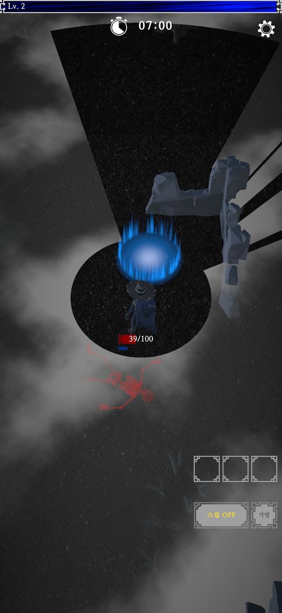<br /><sub>탈출 포탈</sub></td>
<td align="center">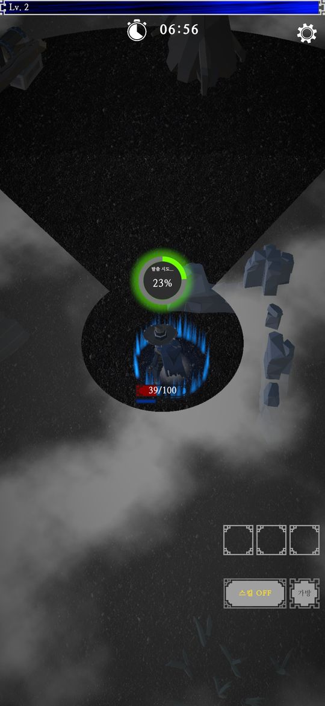<br /><sub>탈출 게이지</sub></td>
<td align="center">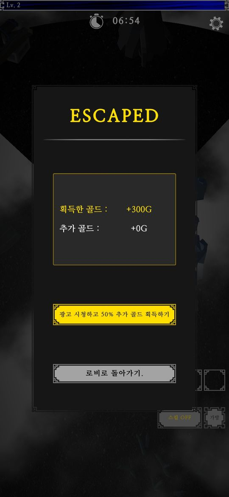<br /><sub>탈출 성공</sub></td>
<td align="center">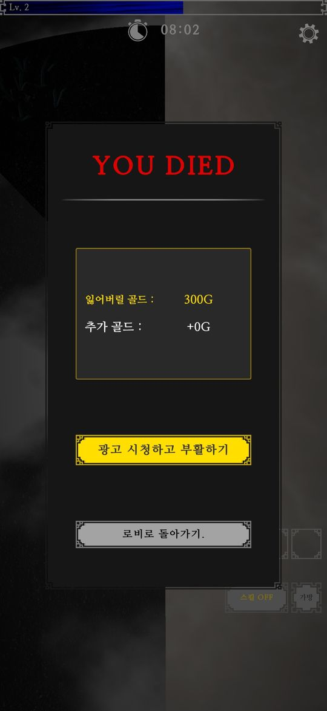<br /><sub>사망 결과</sub></td>
</tr>
</table>
</details>

<details>
<summary><strong>기능 흐름 합성 이미지</strong></summary>
<br />
<p>
  
</p>
<p>
  
</p>
</details>

---

## 공개 범위와 참고 사항

포함된 내용:

- Unity C# 클라이언트 스크립트
- 게임플레이 시스템과 UI 제어 코드
- ScriptableObject 데이터 예시
- 시스템 아키텍처 문서
- 실제 게임 원본 캡처 11장과 기능 흐름 합성 이미지 3장

제외된 내용:

- 상용 에셋과 라이선스 리소스
- 모델, 애니메이션, 텍스처, 오디오
- 전체 씬과 프리팹
- 실제 광고 키와 배포 설정

따라서 이 저장소는 전체 실행 프로젝트가 아니라 **코드 구조, 시스템 설계, Unity 클라이언트 구현 역량을 검토하기 위한 포트폴리오**입니다.

---

## 링크

- **Playable Build**: [itch.io에서 ASH:BORN 플레이](https://lookiesr.itch.io/ashborn)
- **Additional Videos**: [`Docs/videos.md`](Docs/videos.md)
